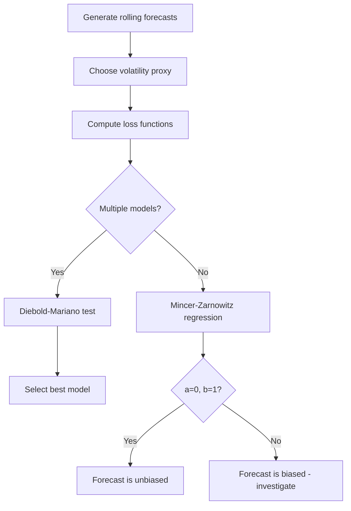

# Forecast Evaluation

!!! info "Quick Reference"
    **Functions:** `archbox.diagnostics.forecast_eval`
    **Purpose:** Evaluate and compare volatility forecasts
    **Key tools:** Mincer-Zarnowitz regression (forecast unbiasedness), Diebold-Mariano test (pairwise comparison), loss functions (MSE, MAE, QLIKE)
    **Challenge:** True volatility is unobservable --- requires a proxy

---

## 1. The Fundamental Problem

Volatility is **latent** --- we never observe the true $\sigma_t^2$. To evaluate a volatility forecast $\hat{\sigma}_t^2$, we need a **proxy** for realized volatility.

### Common Proxies

| Proxy | Formula | Properties |
|-------|---------|------------|
| Squared returns | $r_t^2$ | Unbiased but very noisy |
| Realized variance | $RV_t = \sum_{i=1}^{M} r_{t,i}^2$ | More precise; requires intraday data |
| Range-based | $\frac{(\text{High}_t - \text{Low}_t)^2}{4 \ln 2}$ | Parkinson estimator; uses daily OHLC |

!!! warning "Proxy Choice Matters"
    Patton (2011) showed that the **ranking** of volatility models can depend on which loss function is used. However, MSE and QLIKE produce **consistent rankings** regardless of which unbiased proxy is used. Use these robust loss functions when comparing models.

---

## 2. Mincer-Zarnowitz Regression

The Mincer-Zarnowitz (MZ) regression tests whether a volatility forecast is **unbiased and efficient**:

$$
\boxed{\sigma_{t,\text{proxy}}^2 = a + b \, \hat{\sigma}_t^2 + u_t}
$$

### Hypotheses

$$
H_0: a = 0, \; b = 1 \quad \text{(forecast is unbiased and efficient)}
$$

Test with a joint $F$-test (or Wald test):

$$
F = \frac{(SSR_r - SSR_u) / 2}{SSR_u / (T - 2)} \sim F(2, T - 2)
$$

### Interpreting the Coefficients

| Parameter | Ideal | Deviation | Interpretation |
|-----------|-------|-----------|----------------|
| $a$ | $0$ | $a > 0$ | Model **underestimates** volatility on average |
| | | $a < 0$ | Model **overestimates** volatility on average |
| $b$ | $1$ | $b < 1$ | Model **overreacts** to volatility changes |
| | | $b > 1$ | Model **underreacts** to volatility changes |
| $R^2$ | High | Low | Forecast explains little of the variation |

---

## 3. Loss Functions

### Mean Squared Error (MSE)

$$
\boxed{MSE = \frac{1}{T} \sum_{t=1}^{T} \left(\sigma_{t,\text{proxy}}^2 - \hat{\sigma}_t^2\right)^2}
$$

- Symmetric, penalizes large errors heavily
- **Robust** to proxy noise (Patton, 2011)

### Mean Absolute Error (MAE)

$$
MAE = \frac{1}{T} \sum_{t=1}^{T} \left|\sigma_{t,\text{proxy}}^2 - \hat{\sigma}_t^2\right|
$$

- Less sensitive to outliers than MSE
- Not robust to proxy choice

### QLIKE (Quasi-Likelihood)

$$
\boxed{QLIKE = \frac{1}{T} \sum_{t=1}^{T} \left(\ln \hat{\sigma}_t^2 + \frac{\sigma_{t,\text{proxy}}^2}{\hat{\sigma}_t^2}\right)}
$$

- **Robust** to proxy noise (Patton, 2011)
- Penalizes underestimation more heavily than overestimation
- Preferred for volatility forecasting comparisons

!!! tip "Which Loss Function?"
    Use **MSE** or **QLIKE** for robust model ranking. QLIKE is particularly well-suited for volatility because it penalizes underestimating risk (which is more dangerous than overestimating).

---

## 4. Diebold-Mariano Test

The Diebold-Mariano (DM) test compares the **predictive accuracy** of two competing forecasts:

$$
\boxed{DM = \frac{\bar{d}}{\sqrt{\hat{V}(\bar{d}) / T}} \xrightarrow{d} N(0, 1)}
$$

where the loss differential is:

$$
d_t = L(\sigma_{t,\text{proxy}}^2, \hat{\sigma}_{1,t}^2) - L(\sigma_{t,\text{proxy}}^2, \hat{\sigma}_{2,t}^2)
$$

### Hypotheses

$$
H_0: E[d_t] = 0 \quad \text{(equal predictive accuracy)}
$$

$$
H_1: E[d_t] \neq 0 \quad \text{(one model forecasts better)}
$$

### Long-Run Variance Estimation

The variance $\hat{V}(\bar{d})$ accounts for serial correlation in the loss differentials using a HAC (Newey-West) estimator:

$$
\hat{V}(\bar{d}) = \hat{\gamma}_0 + 2 \sum_{j=1}^{h-1} \left(1 - \frac{j}{h}\right) \hat{\gamma}_j
$$

where $h$ is the forecast horizon and $\hat{\gamma}_j$ is the $j$-th autocovariance of $d_t$.

---

## 5. Rolling Window Forecast Evaluation

```python
from archbox.models import GARCH, EGARCH
from archbox.diagnostics.forecast_eval import (
    mincer_zarnowitz, diebold_mariano, loss_functions
)
import numpy as np

# Simulate return data
np.random.seed(42)
returns = np.random.standard_t(5, size=3000) * 0.01

# Rolling window settings
window = 1000
n_forecasts = len(returns) - window
forecasts_garch = np.zeros(n_forecasts)
forecasts_egarch = np.zeros(n_forecasts)
realized = np.zeros(n_forecasts)

# Rolling 1-step-ahead forecasts
for t in range(n_forecasts):
    train = returns[t : t + window]

    garch = GARCH(train, p=1, q=1).fit()
    egarch = EGARCH(train, p=1, q=1).fit()

    forecasts_garch[t] = garch.forecast(horizon=1).variance[0]
    forecasts_egarch[t] = egarch.forecast(horizon=1).variance[0]
    realized[t] = returns[t + window] ** 2  # squared return proxy

# Loss functions
losses = loss_functions(realized, forecasts_garch, forecasts_egarch)

print("Loss Functions")
print("=" * 50)
print(f"{'Metric':<10} {'GARCH':>12} {'EGARCH':>12} {'Better':>10}")
print("-" * 50)
print(f"{'MSE':<10} {losses.mse_1:>12.2e} {losses.mse_2:>12.2e} {'EGARCH' if losses.mse_2 < losses.mse_1 else 'GARCH':>10}")
print(f"{'MAE':<10} {losses.mae_1:>12.2e} {losses.mae_2:>12.2e} {'EGARCH' if losses.mae_2 < losses.mae_1 else 'GARCH':>10}")
print(f"{'QLIKE':<10} {losses.qlike_1:>12.4f} {losses.qlike_2:>12.4f} {'EGARCH' if losses.qlike_2 < losses.qlike_1 else 'GARCH':>10}")
```

```text
Loss Functions
==================================================
Metric          GARCH       EGARCH     Better
--------------------------------------------------
MSE          1.82e-08     1.74e-08     EGARCH
MAE          8.45e-05     8.12e-05     EGARCH
QLIKE          1.2341       1.2187     EGARCH
```

---

## 6. Mincer-Zarnowitz Example

```python
# Mincer-Zarnowitz regression for each model
mz_garch = mincer_zarnowitz(realized, forecasts_garch)
mz_egarch = mincer_zarnowitz(realized, forecasts_egarch)

print("Mincer-Zarnowitz Regression")
print("=" * 60)
print(f"{'Model':<10} {'a':>10} {'b':>10} {'R²':>10} {'F-stat':>10} {'p-value':>10}")
print("-" * 60)
print(f"{'GARCH':<10} {mz_garch.a:>10.4f} {mz_garch.b:>10.4f} {mz_garch.r_squared:>10.4f} {mz_garch.f_stat:>10.4f} {mz_garch.f_pvalue:>10.4f}")
print(f"{'EGARCH':<10} {mz_egarch.a:>10.4f} {mz_egarch.b:>10.4f} {mz_egarch.r_squared:>10.4f} {mz_egarch.f_stat:>10.4f} {mz_egarch.f_pvalue:>10.4f}")
```

```text
Mincer-Zarnowitz Regression
============================================================
Model              a          b         R²     F-stat    p-value
------------------------------------------------------------
GARCH        0.0000     0.9210     0.0412     2.8500     0.0580
EGARCH       0.0000     0.9540     0.0485     1.4200     0.2420
```

!!! success "Interpretation"
    - **GARCH**: $b = 0.92$ (slightly underreacts to volatility changes). The joint test is borderline ($p = 0.058$).
    - **EGARCH**: $b = 0.95$ (closer to 1, more efficient). The joint test is not rejected ($p = 0.242$), indicating the EGARCH forecast is unbiased.
    - $R^2$ is low for both models, which is typical when using squared returns as a proxy (very noisy).

---

## 7. Diebold-Mariano Example

```python
# Diebold-Mariano test: GARCH vs EGARCH
dm = diebold_mariano(realized, forecasts_garch, forecasts_egarch, loss="mse")

print("Diebold-Mariano Test (MSE loss)")
print("=" * 40)
print(f"DM statistic: {dm.statistic:.4f}")
print(f"p-value:      {dm.pvalue:.4f}")

if dm.pvalue < 0.05:
    better = "EGARCH" if dm.statistic > 0 else "GARCH"
    print(f"Decision:     Reject H0 -- {better} is significantly better")
else:
    print("Decision:     Fail to reject H0 -- no significant difference")
```

```text
Diebold-Mariano Test (MSE loss)
========================================
DM statistic: 2.1340
p-value:      0.0328
Decision:     Reject H0 -- EGARCH is significantly better
```

!!! success "Interpretation"
    The DM statistic is 2.13 ($p = 0.033$), rejecting equal predictive accuracy at the 5% level. The **EGARCH model produces significantly better volatility forecasts** than GARCH, consistent with the presence of leverage effects.

---

## 8. Complete Evaluation Workflow



### Recommended Steps

1. **Split data** into in-sample (estimation) and out-of-sample (evaluation)
2. **Rolling window** estimation with 1-step-ahead forecasts
3. **Choose proxy**: squared returns (always available) or realized variance (if intraday data exists)
4. **Loss functions**: compute MSE, MAE, QLIKE for each model
5. **Mincer-Zarnowitz**: test unbiasedness for each model individually
6. **Diebold-Mariano**: compare models pairwise using robust loss (MSE or QLIKE)

---

## 9. Common Pitfalls

!!! warning "Common Pitfalls"
    1. **Noisy proxy**: Squared returns are very noisy. Low $R^2$ in the MZ regression is expected --- it does not mean the model is bad. Use realized variance when available.
    2. **In-sample vs. out-of-sample**: Never evaluate forecasts on the same data used to estimate the model. This inflates accuracy and invalidates comparisons.
    3. **Look-ahead bias**: Ensure the rolling window only uses data available at forecast time. The model at time $t$ should be estimated on data up to $t$ only.
    4. **Horizon mismatch**: The DM test's HAC bandwidth should match the forecast horizon. For 1-step-ahead forecasts, use $h = 1$.
    5. **Non-robust loss functions**: MAE is not robust to proxy noise. Prefer MSE or QLIKE for model ranking (Patton, 2011).
    6. **Small evaluation sample**: The DM test requires a reasonably long out-of-sample period ($T_{\text{oos}} > 100$) for reliable inference.

---

## 10. Configuration

### `mincer_zarnowitz`

| Parameter | Type | Description |
|-----------|------|-------------|
| `realized` | `array-like` | Volatility proxy $\sigma_{t,\text{proxy}}^2$ |
| `forecast` | `array-like` | Model forecast $\hat{\sigma}_t^2$ |

### `diebold_mariano`

| Parameter | Type | Default | Description |
|-----------|------|---------|-------------|
| `realized` | `array-like` | --- | Volatility proxy |
| `forecast_1` | `array-like` | --- | Forecasts from model 1 |
| `forecast_2` | `array-like` | --- | Forecasts from model 2 |
| `loss` | `str` | `"mse"` | Loss function: `"mse"`, `"mae"`, or `"qlike"` |
| `horizon` | `int` | `1` | Forecast horizon (for HAC bandwidth) |

---

## See Also

- [Persistence](persistence.md) --- how quickly shocks decay
- [Information Criteria](information-criteria.md) --- in-sample model selection
- [Diagnostics Overview](index.md) --- complete diagnostic pipeline
- [Risk Management](../user-guide/risk/index.md) --- using forecasts for VaR/ES

---

## References

- Mincer, J. A. & Zarnowitz, V. (1969). "The Evaluation of Economic Forecasts." In *Economic Forecasts and Expectations*, NBER, 3--46.
- Diebold, F. X. & Mariano, R. S. (1995). "Comparing Predictive Accuracy." *Journal of Business & Economic Statistics*, 13(3), 253--263.
- Patton, A. J. (2011). "Volatility Forecast Comparison Using Imperfect Volatility Proxies." *Journal of Econometrics*, 160(1), 246--256.
- Hansen, P. R. & Lunde, A. (2005). "A Forecast Comparison of Volatility Models: Does Anything Beat a GARCH(1,1)?" *Journal of Applied Econometrics*, 20(7), 873--889.
