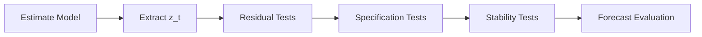

# Diagnostic Tests

!!! abstract "Key Takeaway"
    A GARCH model is only as good as its diagnostics confirm. After estimation, **standardized residuals** $z_t = \varepsilon_t / \sigma_t$ should behave as an i.i.d. sequence from the assumed distribution. This section provides a complete toolkit for verifying this assumption through autocorrelation tests, heteroskedasticity checks, distributional goodness-of-fit, and specification tests.

---

## Why Diagnostics Matter

Estimating a GARCH model is only the first step. Without proper diagnostics, you cannot know whether:

- The **mean equation** adequately captures the conditional mean (autocorrelation in $z_t$)
- The **variance equation** captures all conditional heteroskedasticity (ARCH effects in $z_t^2$)
- The **distributional assumption** matches the observed residual behavior
- The model parameters are **stable** over the sample period

A model that fails diagnostics produces unreliable forecasts, incorrect confidence intervals, and misleading risk measures.

---

## Diagnostic Pipeline

The recommended workflow after estimating any GARCH model follows this sequence:



### Step 1: Extract Standardized Residuals

```python
from archbox.models import GARCH

model = GARCH(returns, p=1, q=1)
result = model.fit()

# Standardized residuals
z_t = result.std_resids
```

### Step 2: Residual Tests

Check whether $z_t$ behaves as i.i.d. from the assumed distribution:

| Test | Target | Question |
|------|--------|----------|
| [Ljung-Box](ljung-box.md) on $z_t$ | Autocorrelation | Is the mean equation adequate? |
| [Ljung-Box](ljung-box.md) on $z_t^2$ | ARCH effects | Is the variance equation adequate? |
| [ARCH-LM](arch-lm.md) | Residual ARCH | Are there remaining ARCH effects? |
| [Jarque-Bera](jarque-bera.md) | Normality | Are residuals normally distributed? |
| [Kolmogorov-Smirnov](kolmogorov-smirnov.md) | Distribution fit | Do residuals follow the assumed distribution? |

### Step 3: Specification Tests

Verify model structure and asymmetry:

| Test | Target | Question |
|------|--------|----------|
| Sign Bias | Asymmetry | Does the model capture leverage effects? |
| News Impact | Shock response | How do positive/negative shocks affect volatility? |
| Information Criteria | Model selection | Which specification fits best? |
| Likelihood Ratio | Nested models | Is the restricted model adequate? |

### Step 4: Stability and Forecast Evaluation

| Test | Target | Question |
|------|--------|----------|
| Nyblom | Parameter stability | Are parameters constant over the sample? |
| Persistence | Stationarity | Is the variance process stationary? |
| Forecast Evaluation | Predictive accuracy | How well does the model forecast out-of-sample? |

---

## Complete Test Reference

| Test | Statistic | Distribution | $H_0$ | Interpretation |
|------|-----------|-------------|--------|----------------|
| **Ljung-Box** ($z_t$) | $Q(m)$ | $\chi^2(m)$ | No autocorrelation | Reject → mean model inadequate |
| **Ljung-Box** ($z_t^2$) | $Q(m)$ | $\chi^2(m)$ | No ARCH effects | Reject → variance model inadequate |
| **ARCH-LM** | $T \cdot R^2$ | $\chi^2(q)$ | No ARCH effects | Reject → residual heteroskedasticity |
| **Jarque-Bera** | $JB$ | $\chi^2(2)$ | Normality | Reject → non-normal residuals |
| **Kolmogorov-Smirnov** | $D_n$ | KS distribution | Correct distribution | Reject → distributional misspecification |
| **Sign Bias** | $t$-stats | $F$-test | No asymmetry | Reject → consider asymmetric model |
| **Nyblom** | $H$ | Nyblom bounds | Parameter stability | Reject → structural change |

---

## Quick Diagnostics

ArchBox provides a convenience function that runs all standard diagnostic tests at once:

```python
from archbox.diagnostics import full_diagnostics

report = full_diagnostics(result)
print(report.summary())
```

```text
==============================================================
Diagnostic Report
==============================================================
Test                    Statistic    p-value    Decision
--------------------------------------------------------------
ARCH-LM (1 lag)            0.234     0.6287    PASS
ARCH-LM (5 lags)           2.156     0.8272    PASS
ARCH-LM (10 lags)          5.432     0.8607    PASS
Ljung-Box z² (5 lags)      3.215     0.6674    PASS
Ljung-Box z² (10 lags)     7.891     0.6393    PASS
Ljung-Box z² (20 lags)    15.234     0.7634    PASS
Sign Bias (joint)           2.145     0.5428    PASS
Jarque-Bera               12.567     0.0019    FAIL
Nyblom (joint)              0.456     > 0.10   PASS
==============================================================
```

!!! tip "Interpreting the Report"
    - **PASS** means we fail to reject $H_0$ at 5% significance — the model passes that check.
    - **FAIL** on Jarque-Bera is common and expected when using Normal distribution with financial data. Consider switching to Student-$t$ or Skewed-$t$.
    - All ARCH-LM and Ljung-Box tests should PASS for a well-specified model.

---

## See Also

- [GARCH Theory](../theory/garch-theory.md) — theoretical foundations
- [Choosing a Model](../getting-started/choosing-model.md) — model selection guide
- [Risk Management](../theory/risk-theory.md) — how diagnostics affect risk measures
