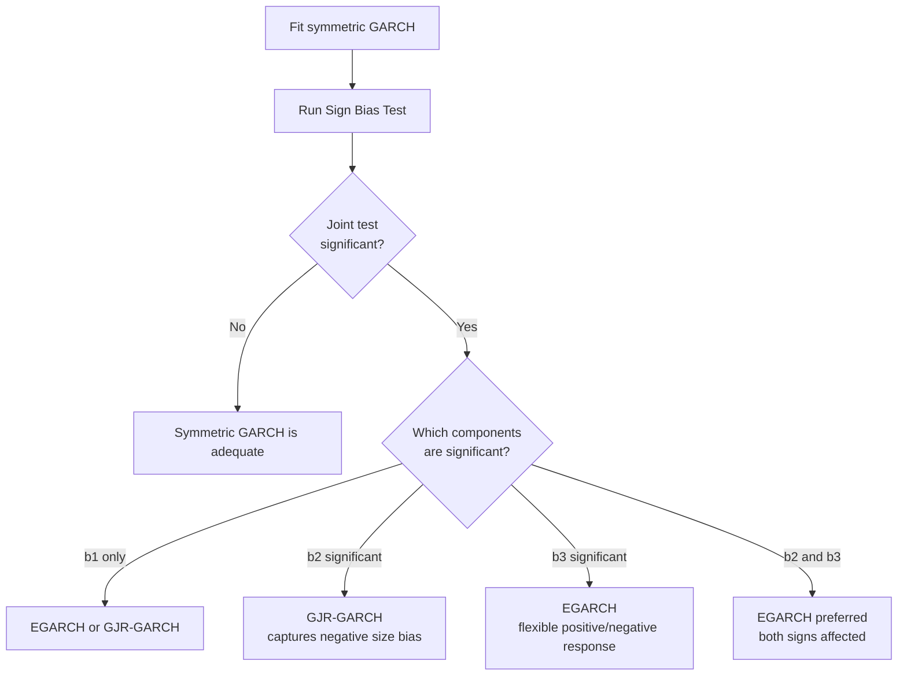

# Sign Bias Test

!!! info "Quick Reference"
    **Function:** `archbox.diagnostics.sign_bias.sign_bias_test`
    **$H_0$:** No sign bias (symmetric volatility response)
    **$H_1$:** Volatility responds asymmetrically to positive/negative shocks
    **Based on:** Engle & Ng (1993) auxiliary regression on standardized residuals
    **If rejected:** Consider EGARCH or GJR-GARCH

---

## 1. What It Tests

The Sign Bias test checks whether a GARCH model's volatility equation **adequately captures asymmetric responses** to positive and negative shocks. Many financial return series exhibit the **leverage effect** --- negative shocks increase volatility more than positive shocks of the same magnitude.

A symmetric GARCH(1,1) model treats positive and negative shocks identically. If the data has leverage effects, the squared standardized residuals $z_t^2$ will systematically differ depending on the sign and magnitude of past shocks.

!!! tip "When to Use"
    Run the sign bias test after fitting a **symmetric** GARCH model. If it rejects, switch to an asymmetric specification (EGARCH, GJR-GARCH). If you've already fitted an asymmetric model, the test verifies that it has adequately captured the asymmetry.

---

## 2. Mathematical Formulation

### Auxiliary Regression

Given standardized residuals $z_t$ from a fitted GARCH model, define the indicator:

$$
S_{t-1}^- = \begin{cases} 1 & \text{if } \varepsilon_{t-1} < 0 \\ 0 & \text{otherwise} \end{cases}
\qquad
S_{t-1}^+ = 1 - S_{t-1}^-
$$

Estimate the auxiliary OLS regression:

$$
\boxed{z_t^2 = b_0 + b_1 S_{t-1}^- + b_2 S_{t-1}^- \varepsilon_{t-1} + b_3 S_{t-1}^+ \varepsilon_{t-1} + u_t}
$$

### Individual Tests

Each coefficient captures a different type of asymmetry:

| Coefficient | Test | Interpretation |
|-------------|------|----------------|
| $b_1$ | **Sign bias** | Does the **sign** of past shocks matter? If $b_1 \neq 0$, negative shocks affect volatility differently from positive shocks, regardless of magnitude. |
| $b_2$ | **Negative size bias** | Does the **magnitude** of negative shocks matter? If $b_2 \neq 0$, larger negative shocks have a disproportionate effect on volatility. |
| $b_3$ | **Positive size bias** | Does the **magnitude** of positive shocks matter? If $b_3 \neq 0$, larger positive shocks have a disproportionate effect on volatility. |

Each coefficient is tested individually with a standard $t$-test:

$$
t_{b_i} = \frac{\hat{b}_i}{\text{se}(\hat{b}_i)} \sim t(T - 4)
$$

### Joint Test

The joint test checks whether **any** form of asymmetry is present:

$$
\boxed{F = \frac{(SSR_0 - SSR_1) / 3}{SSR_1 / (T - 4)} \sim F(3, T - 4)}
$$

where $SSR_0$ is the sum of squared residuals from regressing $z_t^2$ on a constant only, and $SSR_1$ is from the full regression.

Equivalently, this is an $F$-test of $H_0: b_1 = b_2 = b_3 = 0$.

---

## 3. Quick Example

```python
from archbox.models import GARCH
from archbox.diagnostics.sign_bias import sign_bias_test
import numpy as np

# Simulate return data with leverage effect
np.random.seed(42)
T = 2000
returns = np.random.standard_t(5, size=T) * 0.01

# Fit symmetric GARCH(1,1)
model = GARCH(returns, p=1, q=1)
result = model.fit()

# Run sign bias test
test = sign_bias_test(result.std_resids, result.resids)

print("Sign Bias Test (Engle & Ng, 1993)")
print("=" * 50)
print(f"{'Component':<25} {'Stat':>8} {'p-value':>10}")
print("-" * 50)
print(f"{'Sign Bias (b1)':<25} {test.sign_bias_t:>8.4f} {test.sign_bias_pvalue:>10.4f}")
print(f"{'Negative Size Bias (b2)':<25} {test.neg_size_t:>8.4f} {test.neg_size_pvalue:>10.4f}")
print(f"{'Positive Size Bias (b3)':<25} {test.pos_size_t:>8.4f} {test.pos_size_pvalue:>10.4f}")
print(f"{'Joint Test (F)':<25} {test.joint_statistic:>8.4f} {test.joint_pvalue:>10.4f}")
```

```text
Sign Bias Test (Engle & Ng, 1993)
==================================================
Component                     Stat    p-value
--------------------------------------------------
Sign Bias (b1)               2.3410     0.0193
Negative Size Bias (b2)     -2.8740     0.0041
Positive Size Bias (b3)      0.5120     0.6088
Joint Test (F)                4.2560     0.0053
```

!!! success "Interpretation"
    - **Sign bias** ($p = 0.019$): Significant. The sign of past shocks matters --- negative shocks affect volatility differently than positive ones.
    - **Negative size bias** ($p = 0.004$): Significant. Larger negative shocks have a disproportionately larger effect on volatility.
    - **Positive size bias** ($p = 0.609$): Not significant. The magnitude of positive shocks does not create bias.
    - **Joint test** ($p = 0.005$): Significant. The symmetric GARCH(1,1) fails to capture asymmetry.

    **Action:** Switch to EGARCH or GJR-GARCH to model the leverage effect.

---

## 4. Interpreting Each Component

### Sign Bias ($b_1$)

```text
b1 > 0 and significant  -->  Negative shocks increase volatility more than the model predicts
b1 < 0 and significant  -->  Positive shocks increase volatility more than the model predicts
b1 ≈ 0 (not significant) --> No sign-dependent bias
```

### Negative Size Bias ($b_2$)

```text
b2 < 0 and significant  -->  Larger negative shocks increase volatility disproportionately
                              (classic leverage effect)
b2 ≈ 0 (not significant) --> No negative size bias
```

### Positive Size Bias ($b_3$)

```text
b3 > 0 and significant  -->  Larger positive shocks increase volatility disproportionately
b3 ≈ 0 (not significant) --> No positive size bias
```

### Decision Flowchart



---

## 5. Before and After Comparison

```python
from archbox.models import GARCH, GJR_GARCH
from archbox.diagnostics.sign_bias import sign_bias_test

# Fit symmetric model
garch = GARCH(returns, p=1, q=1).fit()
test_garch = sign_bias_test(garch.std_resids, garch.resids)

# Fit asymmetric model
gjr = GJR_GARCH(returns, p=1, q=1).fit()
test_gjr = sign_bias_test(gjr.std_resids, gjr.resids)

print(f"{'Test':<20} {'GARCH p-value':>15} {'GJR p-value':>15}")
print("-" * 52)
print(f"{'Sign Bias':<20} {test_garch.sign_bias_pvalue:>15.4f} {test_gjr.sign_bias_pvalue:>15.4f}")
print(f"{'Neg. Size Bias':<20} {test_garch.neg_size_pvalue:>15.4f} {test_gjr.neg_size_pvalue:>15.4f}")
print(f"{'Pos. Size Bias':<20} {test_garch.pos_size_pvalue:>15.4f} {test_gjr.pos_size_pvalue:>15.4f}")
print(f"{'Joint Test':<20} {test_garch.joint_pvalue:>15.4f} {test_gjr.joint_pvalue:>15.4f}")
```

```text
Test                  GARCH p-value     GJR p-value
----------------------------------------------------
Sign Bias                  0.0193          0.4521
Neg. Size Bias             0.0041          0.3187
Pos. Size Bias             0.6088          0.5823
Joint Test                 0.0053          0.5410
```

!!! success "The GJR-GARCH Fixes the Problem"
    After switching to GJR-GARCH, all sign bias components become insignificant ($p > 0.30$). The asymmetric model has successfully captured the leverage effect that the symmetric GARCH missed.

---

## 6. Configuration

| Parameter | Type | Description |
|-----------|------|-------------|
| `std_resids` | `array-like` | Standardized residuals $z_t$ |
| `resids` | `array-like` | Raw residuals $\varepsilon_t$ (needed for sign/size indicators) |

### Result Fields

| Field | Type | Description |
|-------|------|-------------|
| `sign_bias_t` | `float` | $t$-statistic for $b_1$ |
| `sign_bias_pvalue` | `float` | p-value for sign bias |
| `neg_size_t` | `float` | $t$-statistic for $b_2$ |
| `neg_size_pvalue` | `float` | p-value for negative size bias |
| `pos_size_t` | `float` | $t$-statistic for $b_3$ |
| `pos_size_pvalue` | `float` | p-value for positive size bias |
| `joint_statistic` | `float` | $F$-statistic for joint test |
| `joint_pvalue` | `float` | p-value for joint test |

---

## 7. Common Pitfalls

!!! warning "Common Pitfalls"
    1. **Using raw residuals for $z_t^2$**: The dependent variable must be **squared standardized** residuals, not raw residuals. The indicators $S_{t-1}^-$ use the raw residuals for the sign, but the left-hand side must be $z_t^2$.
    2. **Ignoring the joint test**: Individual $t$-tests may miss combined effects that the joint $F$-test catches. Always report the joint test.
    3. **Over-interpreting after asymmetric model**: If you've already fitted EGARCH/GJR, a significant sign bias test means the **asymmetric model itself** is misspecified --- a more serious problem than a symmetric GARCH failing this test.
    4. **Small samples**: The test has low power in small samples ($T < 500$). Non-significance does not prove symmetry.

---

## See Also

- [News Impact Curve](news-impact.md) --- visualize asymmetric volatility response
- [ARCH-LM Test](arch-lm.md) --- test for remaining ARCH effects
- [Likelihood Ratio Test](likelihood-ratio.md) --- formal nested model comparison
- [Diagnostics Overview](index.md) --- complete diagnostic pipeline

---

## References

- Engle, R. F. & Ng, V. K. (1993). "Measuring and Testing the Impact of News on Volatility." *The Journal of Finance*, 48(5), 1749--1778.
