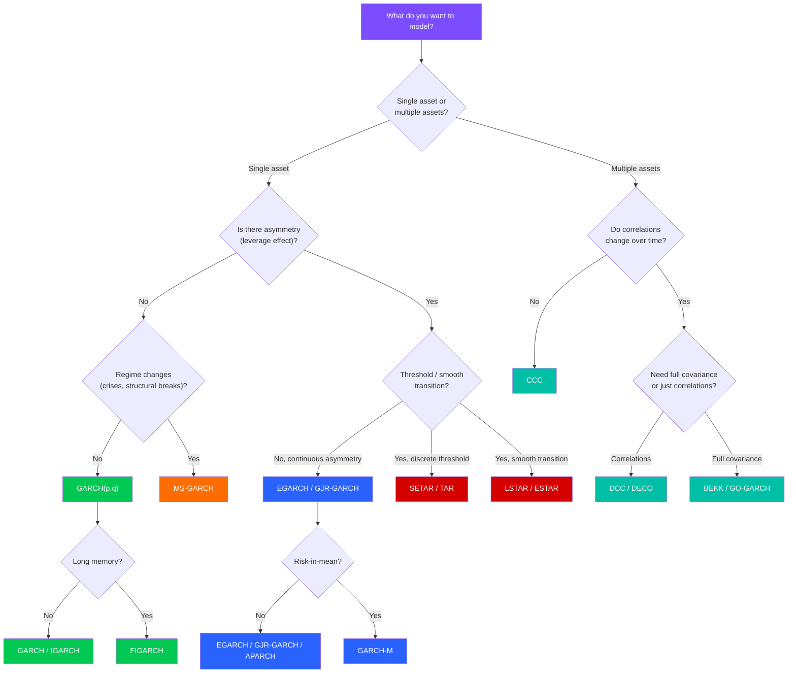

# Choosing a Model

ArchBox offers a rich ecosystem of models -- from simple univariate GARCH to multivariate DCC, regime-switching MS-GARCH, and threshold STAR models. This guide helps you pick the right one for your problem.

!!! tip "Don't know where to start?"

    If this is your first time, start with a standard **GARCH(1,1)**. It's the workhorse of volatility modeling and a natural baseline for comparison. See the [Quick Start](quickstart.md) for a hands-on walkthrough.

---

## Decision Tree

Use this flowchart to narrow down the model family that fits your problem:



!!! note "Multiple models may apply"

    Real-world problems often combine features -- e.g., asymmetric volatility with regime changes. Use the [quantitative criteria](#quantitative-selection-criteria) below to compare competing models systematically.

---

## Model Comparison Table

| Model | Family | Asymmetry | Long Memory | Regime | Complexity | Typical Use Case |
|:------|:-------|:---------:|:-----------:|:------:|:----------:|:-----------------|
| [GARCH(p,q)](../user-guide/garch/garch.md) | Univariate | -- | -- | -- | Low | Baseline volatility modeling |
| [EGARCH](../user-guide/garch/egarch.md) | Univariate | :material-check: | -- | -- | Medium | Leverage effect (equities) |
| [GJR-GARCH](../user-guide/garch/gjr-garch.md) | Univariate | :material-check: | -- | -- | Medium | Asymmetric news impact |
| [APARCH](../user-guide/garch/aparch.md) | Univariate | :material-check: | -- | -- | Medium | Power transformations |
| [FIGARCH](../user-guide/garch/figarch.md) | Univariate | -- | :material-check: | -- | Medium | Slow-decaying autocorrelation |
| [IGARCH](../user-guide/garch/igarch.md) | Univariate | -- | -- | -- | Low | Unit-root in variance |
| [GARCH-M](../user-guide/garch/garch-m.md) | Univariate | -- | -- | -- | Medium | Risk premium estimation |
| [Component GARCH](../user-guide/garch/component.md) | Univariate | -- | -- | -- | Medium | Short/long-run volatility decomposition |
| [HAR-RV](../user-guide/garch/har-rv.md) | Realized Vol | -- | :material-check: | -- | Low | High-frequency data |
| [CCC](../user-guide/multivariate/ccc.md) | Multivariate | -- | -- | -- | Low | Constant correlation baseline |
| [DCC](../user-guide/multivariate/dcc.md) | Multivariate | -- | -- | -- | Medium | Time-varying correlations |
| [BEKK](../user-guide/multivariate/bekk.md) | Multivariate | -- | -- | -- | High | Full covariance dynamics |
| [GO-GARCH](../user-guide/multivariate/go-garch.md) | Multivariate | -- | -- | -- | High | Orthogonal factor decomposition |
| [DECO](../user-guide/multivariate/deco.md) | Multivariate | -- | -- | -- | Medium | Equicorrelation for large portfolios |
| [MS-AR](../user-guide/regime-switching/ms-ar.md) | Regime | -- | -- | :material-check: | High | Mean regime changes |
| [MS-GARCH](../user-guide/regime-switching/ms-garch.md) | Regime | -- | -- | :material-check: | High | Volatility regime changes |
| [TAR](../user-guide/threshold/tar.md) | Threshold | -- | -- | -- | Medium | Discrete threshold effects |
| [SETAR](../user-guide/threshold/setar.md) | Threshold | :material-check: | -- | -- | Medium | Self-exciting threshold dynamics |
| [LSTAR](../user-guide/threshold/lstar.md) | Threshold | :material-check: | -- | -- | Medium | Smooth logistic transition |
| [ESTAR](../user-guide/threshold/estar.md) | Threshold | :material-check: | -- | -- | Medium | Smooth exponential transition |

---

## Guide by Use Case

### 1. Modeling Stock Volatility

**Problem**: You want to model and forecast the conditional volatility of a single equity or index.

**Recommended models**: [GARCH(1,1)](../user-guide/garch/garch.md), [EGARCH](../user-guide/garch/egarch.md), [GJR-GARCH](../user-guide/garch/gjr-garch.md)

!!! info "Why these models?"

    Equity returns exhibit **volatility clustering** (large shocks followed by large shocks) and **leverage effect** (negative returns increase future volatility more than positive returns of the same magnitude). EGARCH and GJR-GARCH capture this asymmetry.

```python
from archbox import GARCH, EGARCH, GJRGARCH
from archbox.datasets import load_dataset

returns = load_dataset("sp500")["returns"].to_numpy()

# Baseline: symmetric GARCH(1,1)
garch = GARCH(returns, p=1, q=1)
res_garch = garch.fit()

# Asymmetric: EGARCH(1,1)
egarch = EGARCH(returns, p=1, q=1)
res_egarch = egarch.fit()

# Asymmetric: GJR-GARCH(1,1)
gjr = GJRGARCH(returns, p=1, q=1)
res_gjr = gjr.fit()

# Compare by AIC
for name, res in [("GARCH", res_garch), ("EGARCH", res_egarch), ("GJR", res_gjr)]:
    print(f"{name:8s}  AIC={res.aic:.2f}  BIC={res.bic:.2f}")
```

---

### 2. Portfolio Correlation Dynamics

**Problem**: You manage a portfolio of multiple assets and need to estimate how correlations evolve over time for hedging or allocation.

**Recommended models**: [DCC](../user-guide/multivariate/dcc.md), [BEKK](../user-guide/multivariate/bekk.md), [DECO](../user-guide/multivariate/deco.md)

!!! info "Why these models?"

    Correlations between assets spike during crises -- a phenomenon called **correlation breakdown**. DCC captures this with a parsimonious two-step approach. BEKK models the full covariance matrix directly but scales poorly. DECO is ideal for large portfolios (50+ assets).

```python
from archbox.multivariate import DCC
from archbox.datasets import load_dataset

# Load multi-asset returns
data = load_dataset("forex")  # DataFrame with multiple columns
returns = data[["EURUSD", "GBPUSD", "USDJPY"]].to_numpy()

# Fit DCC model
model = DCC(returns)
results = model.fit()

# Extract time-varying correlation matrix at last observation
last_corr = results.correlation[-1]
print("Last correlation matrix:")
print(last_corr)
```

---

### 3. Detecting Crises and Regime Shifts

**Problem**: You suspect that markets operate in different regimes (e.g., calm vs. turbulent) and want to identify regime transitions.

**Recommended models**: [MS-GARCH](../user-guide/regime-switching/ms-garch.md), [MS-AR](../user-guide/regime-switching/ms-ar.md)

!!! info "Why these models?"

    Regime-switching models assume that the data-generating process switches between $K$ states (typically 2 or 3) governed by a hidden Markov chain. Each state has its own parameters -- e.g., low-volatility and high-volatility regimes. The model estimates the **transition probabilities** and **smoothed state probabilities** that reveal when regimes change.

```python
from archbox.regime import MarkovSwitchingGARCH
from archbox.datasets import load_dataset

returns = load_dataset("sp500")["returns"].to_numpy()

# 2-regime MS-GARCH
model = MarkovSwitchingGARCH(returns, k_regimes=2, p=1, q=1)
results = model.fit()

# Smoothed probabilities of each regime
probs = results.smoothed_probabilities
print(f"High-vol regime probability (last obs): {probs[-1, 1]:.4f}")

# Transition matrix
print("Transition matrix:")
print(results.transition_matrix)
```

---

### 4. Regulatory VaR and Expected Shortfall

**Problem**: You need risk measures compliant with Basel III/IV for regulatory reporting or internal risk limits.

**Recommended models**: [GARCH(1,1)](../user-guide/garch/garch.md) + [VaR](../user-guide/risk/var.md) + [Expected Shortfall](../user-guide/risk/es.md)

!!! info "Why this approach?"

    Basel III requires conditional VaR at 99% and Expected Shortfall at 97.5%. A GARCH model with **Student-t innovations** captures fat tails better than Normal-based approaches. Use [backtesting](../user-guide/risk/backtesting.md) to validate coverage.

```python
from archbox import GARCH
from archbox.risk import ValueAtRisk, ExpectedShortfall, VaRBacktest
from archbox.datasets import load_dataset

returns = load_dataset("sp500")["returns"].to_numpy()

# GARCH(1,1) with Student-t distribution
model = GARCH(returns, p=1, q=1, dist="student-t")
results = model.fit()

# VaR and ES at 1% level (Basel requirement)
var = ValueAtRisk(results, alpha=0.01)
var_series = var.parametric()

es = ExpectedShortfall(results, alpha=0.01)
es_series = es.parametric()

print(f"VaR(1%):  {var_series[-1]:.6f}")
print(f"ES(1%):   {es_series[-1]:.6f}")

# Backtest VaR
backtest = VaRBacktest(returns, var_series, alpha=0.01)
print(backtest.summary())
```

---

### 5. Capturing Nonlinear Dynamics

**Problem**: The relationship between a variable and its lags changes depending on a threshold value -- e.g., different dynamics in expansions vs. recessions.

**Recommended models**: [SETAR](../user-guide/threshold/setar.md), [LSTAR](../user-guide/threshold/lstar.md), [ESTAR](../user-guide/threshold/estar.md)

!!! info "Why these models?"

    Threshold and STAR models capture **nonlinear mean dynamics** where the transition between regimes is either discrete (TAR/SETAR) or smooth (LSTAR/ESTAR). Unlike Markov-switching, the regime is determined by an observable variable (e.g., lagged returns), not a hidden state.

```python
from archbox.threshold import SETAR, LSTAR
from archbox.threshold import linearity_test
from archbox.datasets import load_dataset

returns = load_dataset("sp500")["returns"].to_numpy()

# First, test for nonlinearity
test = linearity_test(returns, lag=1)
print(f"Linearity test p-value: {test.pvalue:.4f}")

# If significant, fit SETAR
setar = SETAR(returns, lag=1, n_regimes=2)
res_setar = setar.fit()
print(f"Threshold: {res_setar.threshold:.6f}")

# Or a smooth-transition LSTAR
lstar = LSTAR(returns, lag=1)
res_lstar = lstar.fit()
print(f"Transition speed (gamma): {res_lstar.gamma:.4f}")
```

---

### 6. Long-Memory Volatility

**Problem**: Autocorrelation in squared returns decays very slowly (hyperbolic decay), and standard GARCH models don't capture this.

**Recommended models**: [FIGARCH](../user-guide/garch/figarch.md), [Component GARCH](../user-guide/garch/component.md)

!!! info "Why these models?"

    FIGARCH introduces a **fractional integration parameter** $d \in (0, 1)$ that allows for long-range dependence in volatility. Component GARCH decomposes volatility into a persistent long-run component and a transitory short-run component.

```python
from archbox.models import FIGARCH, ComponentGARCH
from archbox.datasets import load_dataset

returns = load_dataset("sp500")["returns"].to_numpy()

# FIGARCH(1, d, 1)
figarch = FIGARCH(returns, p=1, q=1)
res_fig = figarch.fit()
print(f"Fractional parameter d: {res_fig.params['d']:.4f}")

# Component GARCH
comp = ComponentGARCH(returns)
res_comp = comp.fit()
print(f"Long-run persistence: {res_comp.long_run_persistence:.4f}")
```

---

### 7. Risk Premium Estimation

**Problem**: You want to test whether higher volatility leads to higher expected returns (risk-return trade-off).

**Recommended model**: [GARCH-M](../user-guide/garch/garch-m.md)

```python
from archbox.models import GARCHM
from archbox.datasets import load_dataset

returns = load_dataset("sp500")["returns"].to_numpy()

# GARCH-in-Mean: mean equation includes conditional variance
model = GARCHM(returns, p=1, q=1)
results = model.fit()
print(f"Risk premium (lambda): {results.params['lambda']:.4f}")
```

---

## Quantitative Selection Criteria

When multiple models are plausible, use quantitative criteria to make an informed choice.

### Information Criteria

**AIC** (Akaike) and **BIC** (Bayesian) balance goodness-of-fit against model complexity:

$$
\text{AIC} = -2 \ln \hat{L} + 2k
$$

$$
\text{BIC} = -2 \ln \hat{L} + k \ln n
$$

where $\hat{L}$ is the maximized likelihood, $k$ is the number of parameters, and $n$ is the sample size. **Lower is better**.

!!! tip "AIC vs. BIC"

    - **AIC** tends to select slightly more complex models -- better for **forecasting**.
    - **BIC** penalizes complexity more heavily -- better for **model identification** (finding the true model).
    - When they disagree, report both and let the application context decide.

### Automated Model Comparison with ArchExperiment

Instead of comparing models manually, use `ArchExperiment` to run a systematic comparison:

```python
from archbox import GARCH, EGARCH, GJRGARCH
from archbox.models import FIGARCH, APARCH
from archbox.experiment import ArchExperiment
from archbox.datasets import load_dataset

returns = load_dataset("sp500")["returns"].to_numpy()

# Define candidate models
models = {
    "GARCH(1,1)":     GARCH(returns, p=1, q=1),
    "GARCH(2,1)":     GARCH(returns, p=2, q=1),
    "EGARCH(1,1)":    EGARCH(returns, p=1, q=1),
    "GJR-GARCH(1,1)": GJRGARCH(returns, p=1, q=1),
    "APARCH(1,1)":    APARCH(returns, p=1, q=1),
    "FIGARCH(1,d,1)": FIGARCH(returns, p=1, q=1),
}

# Run experiment
experiment = ArchExperiment(models)
results = experiment.compare()

# Ranking by AIC
print(results.ranking("aic"))

# Full comparison table
print(results.summary())
```

Expected output:

```text
Model Comparison (ranked by AIC)
=================================================
Rank  Model             AIC          BIC          LogLik
-------------------------------------------------
1     EGARCH(1,1)       -16912.45    -16888.72    8460.23
2     GJR-GARCH(1,1)    -16908.12    -16884.39    8458.06
3     APARCH(1,1)       -16905.78    -16876.14    8458.89
4     GARCH(1,1)        -16896.47    -16878.64    8451.24
5     FIGARCH(1,d,1)    -16894.23    -16870.50    8451.12
6     GARCH(2,1)        -16893.11    -16869.38    8450.56
=================================================
```

### Diagnostic Validation

After selecting a model, validate with diagnostic tests:

| Test | What It Checks | Pass Criterion |
|:-----|:--------------|:---------------|
| [ARCH-LM](../diagnostics/arch-lm.md) | Remaining ARCH effects | p-value > 0.05 |
| [Ljung-Box](../diagnostics/ljung-box.md) | Serial correlation in squared residuals | p-value > 0.05 |
| [Sign Bias](../diagnostics/sign-bias.md) | Asymmetric response to shocks | p-value > 0.05 (if symmetric model) |
| [Jarque-Bera](../diagnostics/jarque-bera.md) | Normality of standardized residuals | p-value > 0.05 |
| [News Impact](../diagnostics/news-impact.md) | Shape of the news impact curve | Visual inspection |

```python
from archbox.diagnostics import arch_lm_test, ljung_box_squared, sign_bias_test

# Run diagnostics on the best model
best = results.best_model("aic")
resid = best.resid

arch_lm = arch_lm_test(resid, lags=5)
lb = ljung_box_squared(resid, lags=10)
sb = sign_bias_test(resid)

print(f"ARCH-LM p-value:   {arch_lm.pvalue:.4f}")
print(f"Ljung-Box p-value: {lb.pvalue:.4f}")
print(f"Sign Bias p-value: {sb.pvalue:.4f}")
```

!!! warning "When diagnostics fail"

    If the ARCH-LM test rejects (p < 0.05), try a higher-order model or a different specification. If the Sign Bias test rejects, switch from a symmetric model (GARCH) to an asymmetric one (EGARCH, GJR-GARCH). If normality is rejected even with standardized residuals, consider using a **Student-t** or **Skewed-t** distribution:

    ```python
    model = GARCH(returns, p=1, q=1, dist="skewed-t")
    results = model.fit()
    ```

    See the [Distributions Guide](../user-guide/distributions/choosing.md) for help selecting the right innovation distribution.

---

## Quick Reference Card

Use this card as a cheat sheet for common decisions:

| Question | Answer | Model |
|:---------|:-------|:------|
| "Just need a baseline" | Start here | [GARCH(1,1)](../user-guide/garch/garch.md) |
| "Returns react asymmetrically to shocks" | Leverage effect | [EGARCH](../user-guide/garch/egarch.md) or [GJR-GARCH](../user-guide/garch/gjr-garch.md) |
| "Volatility has very long memory" | Slow autocorrelation decay | [FIGARCH](../user-guide/garch/figarch.md) |
| "Risk premium in the mean" | GARCH-in-Mean | [GARCH-M](../user-guide/garch/garch-m.md) |
| "Multiple assets, dynamic correlations" | Portfolio hedging | [DCC](../user-guide/multivariate/dcc.md) |
| "Multiple assets, full covariance" | Small portfolio (< 5 assets) | [BEKK](../user-guide/multivariate/bekk.md) |
| "Large portfolio (50+ assets)" | Equicorrelation | [DECO](../user-guide/multivariate/deco.md) |
| "Market regimes (calm/crisis)" | Hidden Markov | [MS-GARCH](../user-guide/regime-switching/ms-garch.md) |
| "Observable threshold effects" | Discrete transition | [SETAR](../user-guide/threshold/setar.md) |
| "Smooth nonlinear transition" | Continuous regime | [LSTAR](../user-guide/threshold/lstar.md) / [ESTAR](../user-guide/threshold/estar.md) |
| "Need VaR / ES for regulation" | Risk measures | [GARCH + VaR](../user-guide/risk/var.md) |
| "High-frequency realized volatility" | Intraday data | [HAR-RV](../user-guide/garch/har-rv.md) |

---

## Next Steps

<div class="grid cards" markdown>

-   :material-book-open-variant: **User Guide**

    ---

    Deep dive into each model family with theory, examples, and best practices

    [:octicons-arrow-right-24: User Guide](../user-guide/index.md)

-   :material-test-tube: **Diagnostics**

    ---

    Full suite of tests to validate your model choice

    [:octicons-arrow-right-24: Diagnostics](../diagnostics/index.md)

-   :material-school-outline: **Tutorials**

    ---

    End-to-end workflows for common applications

    [:octicons-arrow-right-24: Tutorials](../tutorials/index.md)

-   :material-flask-outline: **ArchExperiment**

    ---

    Automated model comparison and selection

    [:octicons-arrow-right-24: ArchExperiment](../user-guide/experiment.md)

</div>
