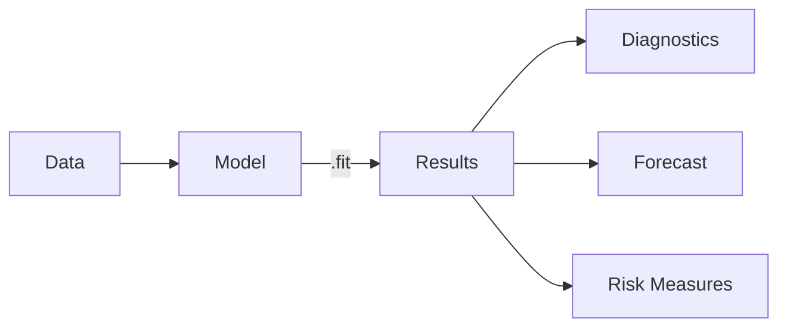
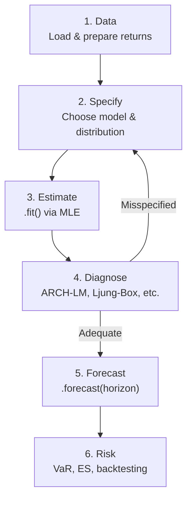

# Core Concepts

Before diving into specific models, it helps to understand the **core building blocks** of ArchBox. This page covers the architecture, key classes, and estimation workflow that are shared across every model in the library.

---

## Architecture: Model-Result Pattern

ArchBox follows a clean **Model-Result** pattern inspired by `statsmodels`. Every analysis follows three steps:



1. **Specify** a model with your data and configuration
2. **Fit** the model to obtain a `Results` object
3. **Analyze** using the rich `Results` API

Here's what that looks like in code:

```python
from archbox import GARCH
from archbox.datasets import load_dataset

# 1. Load data
returns = load_dataset("sp500")["returns"].to_numpy()

# 2. Specify and fit
model = GARCH(returns, p=1, q=1)
results = model.fit()

# 3. Analyze
print(results.summary())
forecast = results.forecast(horizon=5)
```

!!! tip "Why this pattern?"

    Separating specification from estimation lets you configure a model once and re-fit it with different data, distributions, or starting values -- without rebuilding the entire object.

---

## VolatilityModel

`VolatilityModel` is the **abstract base class** that every model in ArchBox inherits from. It defines a consistent interface so you can switch between GARCH, EGARCH, GJR-GARCH, or any other variant with minimal code changes.

### Common Methods

| Method | Description | Returns |
| :--- | :--- | :--- |
| `fit(method, starting_values, variance_targeting, disp)` | Estimate parameters via MLE | `ArchResults` |
| `simulate(n, params, seed)` | Generate synthetic data from the model | `(returns, conditional_volatility)` |
| `loglike(params)` | Compute total log-likelihood for given parameters | `float` |
| `loglike_per_obs(params)` | Log-likelihood contribution of each observation | `np.ndarray` |
| `bounds()` | Parameter bounds for the optimizer | `list[tuple]` |

### Configuration Parameters

When creating any model, you typically specify:

```python
model = GARCH(
    data,                  # np.ndarray or pd.Series of returns
    p=1,                   # ARCH order (lagged squared residuals)
    q=1,                   # GARCH order (lagged conditional variance)
    mean='constant',       # Mean model: 'constant', 'zero', 'ar'
    dist='normal',         # Error distribution (see below)
)
```

!!! info "All models, same interface"

    Whether you're fitting an EGARCH, GJR-GARCH, or APARCH, the workflow is identical: create the model, call `.fit()`, and work with the `Results` object. Only the constructor parameters change.

### Example: Creating and Fitting a Model

=== "GARCH(1,1)"

    ```python
    from archbox import GARCH

    model = GARCH(returns, p=1, q=1)
    results = model.fit()
    ```

=== "EGARCH(1,1)"

    ```python
    from archbox import EGARCH

    model = EGARCH(returns, p=1, q=1)
    results = model.fit()
    ```

=== "GJR-GARCH(1,1,1)"

    ```python
    from archbox import GJR_GARCH

    model = GJR_GARCH(returns, p=1, o=1, q=1)
    results = model.fit()
    ```

---

## Results Object

Calling `.fit()` on any model returns an `ArchResults` object -- your single entry point for everything that comes after estimation.

### Attributes

| Attribute | Type | Description |
| :--- | :--- | :--- |
| `params` | `np.ndarray` | Estimated parameter values |
| `param_names` | `list[str]` | Names matching each parameter |
| `loglike` | `float` | Maximized log-likelihood |
| `aic` | `float` | Akaike Information Criterion |
| `bic` | `float` | Bayesian Information Criterion |
| `hqic` | `float` | Hannan-Quinn Information Criterion |
| `resid` | `np.ndarray` | Standardized residuals ($z_t = \varepsilon_t / \sigma_t$) |
| `conditional_volatility` | `np.ndarray` | Estimated $\sigma_t$ series |
| `se` | `np.ndarray` | Standard errors of parameters |
| `tvalues` | `np.ndarray` | t-statistics for each parameter |
| `pvalues` | `np.ndarray` | p-values for each parameter |
| `nobs` | `int` | Number of observations |
| `convergence` | `bool` | Whether the optimizer converged |

### Methods

| Method | Description | Returns |
| :--- | :--- | :--- |
| `summary()` | Formatted estimation summary table | `str` |
| `plot(which)` | Plot volatility (`'volatility'`) or residuals (`'residuals'`) | `matplotlib.Figure` |
| `forecast(horizon, method)` | Multi-step-ahead variance/volatility forecast | `dict` |
| `persistence()` | $\alpha + \beta$ -- measures shock persistence | `float` |
| `half_life()` | Days for a volatility shock to decay by 50% | `float` |
| `unconditional_variance()` | Long-run (unconditional) variance | `float` |
| `to_dataframe()` | Export parameters and statistics to pandas | `pd.DataFrame` |
| `save(path)` / `load(path)` | Serialize/deserialize results | -- |

### Example: Working with Results

```python
results = model.fit()

# Parameter estimates
for name, val, se, pv in zip(
    results.param_names, results.params, results.se, results.pvalues
):
    print(f"{name:12s}  {val:10.6f}  (SE={se:.6f}, p={pv:.4f})")

# Model fit statistics
print(f"Log-Likelihood: {results.loglike:.4f}")
print(f"AIC: {results.aic:.4f}")
print(f"BIC: {results.bic:.4f}")

# Persistence and half-life
print(f"Persistence: {results.persistence():.6f}")
print(f"Half-life: {results.half_life():.1f} days")

# Conditional volatility series
sigma = results.conditional_volatility
print(f"Last volatility: {sigma[-1]:.6f}")
```

!!! warning "Check convergence"

    Always verify that `results.convergence` is `True` before interpreting the output. If the optimizer did not converge, the parameter estimates may be unreliable. Try different starting values or increase the iteration limit.

---

## Conditional Distributions

Financial returns are **fat-tailed** -- extreme moves happen far more often than a Normal distribution predicts. ArchBox lets you choose the distribution of the standardized innovations $z_t$:

### Available Distributions

| Distribution | Class | Extra Parameters | Best For |
| :--- | :--- | :--- | :--- |
| Normal | `Normal` | -- | Baseline, symmetric data |
| Student-t | `StudentT` | $\nu$ (degrees of freedom) | Fat tails, symmetric |
| Skewed Student-t | `SkewedT` | $\nu$, $\lambda$ (skewness) | Fat tails + asymmetry |
| Generalized Error | `GeneralizedError` | $\nu$ (shape) | Flexible tail thickness |
| Mixture Normal | `MixtureNormal` | weights, variances | Multimodal patterns |

### Why Not Just Use Normal?

In financial data, extreme events (crashes, spikes) occur more frequently than the Normal distribution allows. The Student-t distribution adds a parameter $\nu$ (degrees of freedom) that controls how heavy the tails are:

- $\nu \to \infty$: converges to Normal
- $\nu \approx 4\text{--}8$: typical for daily equity returns
- $\nu < 4$: very heavy tails (e.g., emerging markets, crypto)

!!! info "Rule of thumb"

    Start with `dist='student-t'` for financial returns. The extra parameter $\nu$ is estimated automatically by MLE, and the improvement in fit is almost always significant.

### Specifying a Distribution

=== "String shortcut"

    ```python
    # Pass the distribution name as a string
    model = GARCH(returns, p=1, q=1, dist='student-t')
    results = model.fit()
    ```

=== "Distribution object"

    ```python
    from archbox.distributions import StudentT

    # Create and configure explicitly
    dist = StudentT()
    model = GARCH(returns, p=1, q=1, dist=dist)
    results = model.fit()
    ```

=== "Skewed Student-t"

    ```python
    # Capture both fat tails and asymmetry
    model = GARCH(returns, p=1, q=1, dist='skewed-t')
    results = model.fit()
    ```

---

## MLE in 5 Minutes

ArchBox estimates model parameters using **Maximum Likelihood Estimation (MLE)** -- the standard approach in the GARCH literature.

### The Intuition

MLE answers a simple question: *given the data we observed, what parameter values make these observations most probable?*

For a GARCH(1,1) with conditional variance:

$$
\sigma_t^2 = \omega + \alpha \varepsilon_{t-1}^2 + \beta \sigma_{t-1}^2
$$

the optimizer searches for $\theta = (\omega, \alpha, \beta)$ that **maximize** the log-likelihood function.

### The Log-Likelihood

Assuming innovations $z_t \sim \mathcal{N}(0,1)$, the log-likelihood is:

$$
\mathcal{L}(\theta) = -\frac{T}{2} \ln(2\pi) - \frac{1}{2} \sum_{t=1}^{T} \left[ \ln(\sigma_t^2) + \frac{\varepsilon_t^2}{\sigma_t^2} \right]
$$

For a Student-t distribution with $\nu$ degrees of freedom:

$$
\mathcal{L}(\theta, \nu) = T \ln \Gamma\!\left(\frac{\nu+1}{2}\right) - T \ln \Gamma\!\left(\frac{\nu}{2}\right) - \frac{T}{2} \ln\left[(\nu - 2)\pi\right] - \frac{1}{2} \sum_{t=1}^{T} \left[ \ln(\sigma_t^2) + (\nu + 1) \ln\!\left(1 + \frac{\varepsilon_t^2}{(\nu-2)\sigma_t^2}\right) \right]
$$

!!! note "What the optimizer does"

    ArchBox uses numerical optimization (L-BFGS-B by default) to find the $\theta$ that maximizes $\mathcal{L}(\theta)$. The variance recursion is computed at each iteration, making this a nested optimization problem.

### Convergence and Starting Values

The optimizer needs a good starting point to converge reliably. ArchBox handles this automatically:

1. **Variance targeting**: Uses the sample variance to pin down $\omega$, reducing the search space
2. **Smart initialization**: Each model provides sensible default starting values
3. **Parameter bounds**: Enforces stationarity constraints ($\alpha, \beta \geq 0$, $\alpha + \beta < 1$)

If the optimizer doesn't converge, you can provide custom starting values:

```python
import numpy as np

model = GARCH(returns, p=1, q=1)

# Custom starting values: [omega, alpha, beta]
results = model.fit(
    starting_values=np.array([1e-5, 0.05, 0.90]),
    variance_targeting=True,
)
```

---

## The Typical Pipeline

A complete volatility analysis in ArchBox follows six stages:



### Full Example

```python
import numpy as np
from archbox import GARCH
from archbox.datasets import load_dataset
from archbox.diagnostics import arch_lm_test, ljung_box_squared
from archbox.risk import ValueAtRisk, ExpectedShortfall

# ── 1. Data ──────────────────────────────────────────────
returns = load_dataset("sp500")["returns"].to_numpy()

# ── 2. Specify ──────────────────────────────────────────
model = GARCH(returns, p=1, q=1, dist='student-t')

# ── 3. Estimate ─────────────────────────────────────────
results = model.fit()
print(results.summary())

# ── 4. Diagnose ─────────────────────────────────────────
arch_lm = arch_lm_test(results.resid, lags=5)
lb = ljung_box_squared(results.resid, lags=10)

print(f"ARCH-LM p-value:   {arch_lm.pvalue:.4f}")
print(f"Ljung-Box p-value: {lb.pvalue:.4f}")

# ── 5. Forecast ─────────────────────────────────────────
forecast = results.forecast(horizon=10)
print(f"10-day ahead volatility: {forecast['volatility'][-1]:.6f}")

# ── 6. Risk Measures ────────────────────────────────────
var = ValueAtRisk(results, alpha=0.05)
es = ExpectedShortfall(results, alpha=0.05)

print(f"VaR(5%): {var.parametric()[-1]:.6f}")
print(f"ES(5%):  {es.parametric()[-1]:.6f}")
```

!!! tip "Iterative refinement"

    If diagnostics reveal remaining ARCH effects (p-value < 0.05), go back to step 2 and try:

    - Higher-order models: `GARCH(2,1)` or `GARCH(1,2)`
    - Asymmetric models: `EGARCH` or `GJR_GARCH` (captures leverage effects)
    - Heavier-tailed distributions: `'student-t'` or `'skewed-t'`

---

## Next Steps

<div class="grid cards" markdown>

-   :material-compass-outline: **Choosing a Model**

    ---

    Not sure which GARCH variant fits your data? This guide walks you through the decision

    [:octicons-arrow-right-24: Choosing a Model](choosing-model.md)

-   :material-book-open-variant: **User Guide**

    ---

    Deep dives into every model family: univariate, multivariate, regime-switching, and more

    [:octicons-arrow-right-24: User Guide](../user-guide/index.md)

-   :material-function-variant: **API Reference**

    ---

    Complete reference for every class, method, and parameter

    [:octicons-arrow-right-24: API Reference](../api/index.md)

-   :material-test-tube: **Diagnostics**

    ---

    Full suite of tests to validate your model specification

    [:octicons-arrow-right-24: Diagnostics](../diagnostics/index.md)

</div>
