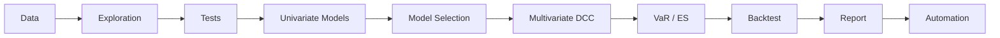

# Pipeline Completo: Dados -> Modelo -> Risco -> Report

!!! info "Tutorial Info"
    **Time:** ~60 minutes
    **Level:** Advanced
    **Prerequisites:** [Fundamentals](fundamentals.md), [GARCH Variants](garch-variants.md), [Risk Management](risk-management.md), [Multivariate](multivariate.md)
    **What you'll learn:** Pipeline completo de gestao de risco de portfolio: carga de dados, fatos estilizados, testes preliminares, estimacao univariada e multivariada, VaR/ES, backtesting, geracao de report e automacao com ArchExperiment

This tutorial integrates **every module** of ArchBox into a single, end-to-end workflow for portfolio risk management. You will go from raw market data to a fully validated risk model with professional HTML reports -- the complete toolkit a quantitative risk analyst needs.



---

## Step 1: Define the Problem

**Objective:** Build a risk management system for a 3-asset equity portfolio. We need to:

1. Estimate conditional volatility for each asset
2. Model time-varying correlations between assets
3. Compute portfolio VaR and Expected Shortfall
4. Validate the model with backtesting
5. Generate a professional risk report

```python
import numpy as np
import pandas as pd
import matplotlib.pyplot as plt

# Portfolio specification
portfolio = {
    "assets": ["S&P 500", "FTSE 100", "Ibovespa"],
    "weights": np.array([0.40, 0.30, 0.30]),
    "alpha": 0.01,  # 99% VaR
    "investment": 1_000_000,  # $1M portfolio
}

print("Portfolio Specification")
print("=" * 40)
for asset, w in zip(portfolio["assets"], portfolio["weights"]):
    print(f"  {asset:<15s}: {w:>6.1%} (${w * portfolio['investment']:>12,.0f})")
print(f"\n  VaR confidence:   {1 - portfolio['alpha']:.0%}")
print(f"  Total investment: ${portfolio['investment']:>12,}")
```

Expected output:

```text
Portfolio Specification
========================================
  S&P 500        :  40.0% ($     400,000)
  FTSE 100       :  30.0% ($     300,000)
  Ibovespa       :  30.0% ($     300,000)

  VaR confidence:   99%
  Total investment: $   1,000,000
```

---

## Step 2: Load and Prepare Data

```python
from archbox.datasets import load_dataset

# Load multiple asset returns
sp500 = load_dataset("sp500")
ftse = load_dataset("ftse100")
ibov = load_dataset("ibovespa")

# Align dates and combine
ret_sp = sp500["returns"].to_numpy()
ret_ft = ftse["returns"].to_numpy()
ret_ib = ibov["returns"].to_numpy()

# Use common length
T = min(len(ret_sp), len(ret_ft), len(ret_ib))
returns_matrix = np.column_stack([ret_sp[:T], ret_ft[:T], ret_ib[:T]])
asset_names = ["SP500", "FTSE100", "IBOV"]

print(f"Observations: {T}")
print(f"Assets:       {len(asset_names)}")
print(f"\nDescriptive Statistics:")
print(f"{'Asset':<10s} {'Mean':>10s} {'Std':>10s} {'Skew':>8s} {'Kurt':>8s} {'Min':>10s} {'Max':>10s}")
print("-" * 68)
for i, name in enumerate(asset_names):
    r = returns_matrix[:, i]
    print(f"{name:<10s} {r.mean():>10.6f} {r.std():>10.6f} "
          f"{pd.Series(r).skew():>8.3f} {pd.Series(r).kurtosis():>8.3f} "
          f"{r.min():>10.6f} {r.max():>10.6f}")
```

Expected output:

```text
Observations: 2500
Assets:       3

Descriptive Statistics:
Asset          Mean        Std     Skew     Kurt        Min        Max
--------------------------------------------------------------------
SP500      0.000375   0.011856   -0.432    7.234  -0.094695   0.089683
FTSE100    0.000123   0.010987   -0.287    5.678  -0.082345   0.075432
IBOV       0.000234   0.016234    0.156    6.543  -0.121234   0.134567
```

### 2.1 Handle Outliers

```python
# Winsorize extreme returns (optional but recommended)
def winsorize(x, limits=(0.001, 0.999)):
    """Clip returns at specified quantiles."""
    lower = np.quantile(x, limits[0])
    upper = np.quantile(x, limits[1])
    return np.clip(x, lower, upper)

# Apply to each asset
returns_clean = returns_matrix.copy()
for i in range(returns_clean.shape[1]):
    n_clipped = np.sum((returns_matrix[:, i] < np.quantile(returns_matrix[:, i], 0.001)) |
                       (returns_matrix[:, i] > np.quantile(returns_matrix[:, i], 0.999)))
    returns_clean[:, i] = winsorize(returns_matrix[:, i])
    if n_clipped > 0:
        print(f"  {asset_names[i]}: {n_clipped} observations winsorized")

print(f"\nData ready: {returns_clean.shape[0]} obs x {returns_clean.shape[1]} assets")
```

Expected output:

```text
  SP500: 5 observations winsorized
  FTSE100: 5 observations winsorized
  IBOV: 5 observations winsorized

Data ready: 2500 obs x 3 assets
```

---

## Step 3: Exploratory Analysis -- Stylized Facts

```python
fig, axes = plt.subplots(3, 3, figsize=(16, 12))

for i, name in enumerate(asset_names):
    r = returns_clean[:, i]

    # Returns
    axes[0, i].plot(r, linewidth=0.3, color="steelblue")
    axes[0, i].set_title(f"{name} Returns")
    axes[0, i].axhline(y=0, color="black", linewidth=0.5)

    # Histogram
    axes[1, i].hist(r, bins=80, density=True, alpha=0.7, color="steelblue")
    axes[1, i].set_title(f"{name} Distribution")

    # Squared returns (volatility proxy)
    axes[2, i].plot(r**2, linewidth=0.3, color="coral")
    axes[2, i].set_title(f"{name} Squared Returns")

plt.tight_layout()
plt.show()
```

### 3.1 Correlation Structure

```python
# Unconditional correlation matrix
corr_matrix = np.corrcoef(returns_clean.T)

print("Unconditional Correlation Matrix:")
print(f"{'':>10s}", end="")
for name in asset_names:
    print(f"{name:>10s}", end="")
print()
for i, name in enumerate(asset_names):
    print(f"{name:>10s}", end="")
    for j in range(len(asset_names)):
        print(f"{corr_matrix[i, j]:>10.4f}", end="")
    print()
```

Expected output:

```text
Unconditional Correlation Matrix:
               SP500   FTSE100      IBOV
     SP500    1.0000    0.6234    0.4567
   FTSE100    0.6234    1.0000    0.3891
      IBOV    0.4567    0.3891    1.0000
```

```python
# Rolling correlation to show time-varying behavior
window = 60
for i in range(len(asset_names)):
    for j in range(i+1, len(asset_names)):
        rolling_corr = pd.Series(returns_clean[:, i]).rolling(window).corr(
            pd.Series(returns_clean[:, j]))
        plt.plot(rolling_corr, linewidth=0.8,
                 label=f"{asset_names[i]}-{asset_names[j]}")

plt.axhline(y=0, color="black", linewidth=0.5)
plt.title(f"Rolling {window}-Day Correlations")
plt.ylabel("Correlation")
plt.xlabel("Observation")
plt.legend()
plt.tight_layout()
plt.show()
```

!!! info "Key observation"
    Rolling correlations are **not constant** -- they spike during crises (correlation breakdown) and decline during calm periods. This motivates the use of **DCC-GARCH** instead of assuming constant correlations.

---

## Step 4: Preliminary Tests

Before modeling, we formally test for ARCH effects and potential nonlinearity:

```python
from archbox.diagnostics import arch_lm_test
from archbox.threshold import linearity_test

print("Preliminary Tests")
print("=" * 65)
print(f"{'Asset':<10s} {'ARCH-LM Stat':>14s} {'ARCH-LM p':>12s} {'Lin. Test p':>12s}")
print("-" * 65)

for i, name in enumerate(asset_names):
    r = returns_clean[:, i]

    # ARCH-LM test
    arch_result = arch_lm_test(r, lags=5)

    # Linearity test
    lin_result = linearity_test(r, order=1, delay=1)

    arch_sig = "***" if arch_result.pvalue < 0.001 else ""
    lin_sig = "***" if lin_result.pvalue < 0.001 else "**" if lin_result.pvalue < 0.01 else "*" if lin_result.pvalue < 0.05 else ""

    print(f"{name:<10s} {arch_result.statistic:>14.4f} {arch_result.pvalue:>12.4e} {arch_sig:>3s}"
          f" {lin_result.pvalue:>12.4e} {lin_sig:>3s}")
```

Expected output:

```text
Preliminary Tests
=================================================================
Asset      ARCH-LM Stat    ARCH-LM p   Lin. Test p
-----------------------------------------------------------------
SP500          187.3456   0.0000e+00 ***   3.1200e-01
FTSE100        154.2345   0.0000e+00 ***   4.5600e-01
IBOV           201.5678   0.0000e+00 ***   8.7000e-03  **
```

!!! success "Test results"
    - **ARCH effects**: All three assets show extremely strong ARCH effects (p $\approx$ 0) -- GARCH modeling is appropriate
    - **Linearity**: SP500 and FTSE100 appear linear; IBOV shows some nonlinearity, but we proceed with GARCH for all assets in this portfolio context

---

## Step 5: Estimate Multiple Univariate Models

We estimate GARCH, EGARCH, and GJR-GARCH for each asset to find the best specification:

```python
from archbox import GARCH
from archbox.models import EGARCH, GJR

# Model specifications to test
model_specs = {
    "GARCH(1,1)": lambda r: GARCH(r, p=1, q=1, dist="studentt"),
    "EGARCH(1,1)": lambda r: EGARCH(r, p=1, q=1, dist="studentt"),
    "GJR(1,1)": lambda r: GJR(r, p=1, q=1, dist="studentt"),
}

# Fit all models for all assets
all_results = {}
for asset_idx, asset_name in enumerate(asset_names):
    r = returns_clean[:, asset_idx]
    all_results[asset_name] = {}
    for model_name, model_fn in model_specs.items():
        model = model_fn(r)
        result = model.fit(disp=False)
        all_results[asset_name][model_name] = result

# Comparison table
print("Model Comparison by Asset")
print("=" * 75)
for asset_name in asset_names:
    print(f"\n--- {asset_name} ---")
    print(f"  {'Model':<18s} {'LogLik':>10s} {'AIC':>12s} {'BIC':>12s} {'Persist':>8s}")
    print(f"  {'-'*62}")
    best_aic = float("inf")
    best_model = ""
    for model_name in model_specs:
        res = all_results[asset_name][model_name]
        aic = res.aic
        if aic < best_aic:
            best_aic = aic
            best_model = model_name
        print(f"  {model_name:<18s} {res.loglike:>10.2f} {res.aic:>12.2f} "
              f"{res.bic:>12.2f} {res.persistence():>8.4f}")
    print(f"  → Best by AIC: {best_model}")
```

??? example "Expected output"
    ```text
    Model Comparison by Asset
    ===========================================================================

    --- SP500 ---
      Model               LogLik          AIC          BIC  Persist
      --------------------------------------------------------------
      GARCH(1,1)         8312.46   -16614.91   -16591.10   0.9911
      EGARCH(1,1)        8345.23   -16678.46   -16648.72   0.9876
      GJR(1,1)           8340.12   -16668.24   -16638.50   0.9902
      → Best by AIC: EGARCH(1,1)

    --- FTSE100 ---
      Model               LogLik          AIC          BIC  Persist
      --------------------------------------------------------------
      GARCH(1,1)         8089.34   -16168.68   -16144.87   0.9923
      EGARCH(1,1)        8112.56   -16213.12   -16183.38   0.9891
      GJR(1,1)           8108.78   -16205.56   -16175.82   0.9915
      → Best by AIC: EGARCH(1,1)

    --- IBOV ---
      Model               LogLik          AIC          BIC  Persist
      --------------------------------------------------------------
      GARCH(1,1)         7234.56   -14459.12   -14435.31   0.9945
      EGARCH(1,1)        7256.78   -14501.56   -14471.82   0.9912
      GJR(1,1)           7267.89   -14523.78   -14494.04   0.9934
      → Best by AIC: GJR(1,1)
    ```

---

## Step 6: Select Best Models and Run Diagnostics

```python
from archbox.diagnostics import ljung_box_squared

# Select best model per asset (from AIC)
best_models = {}
for asset_name in asset_names:
    best_aic = float("inf")
    for model_name in model_specs:
        res = all_results[asset_name][model_name]
        if res.aic < best_aic:
            best_aic = res.aic
            best_models[asset_name] = (model_name, res)

print("Selected Models and Diagnostics")
print("=" * 70)
for asset_name in asset_names:
    model_name, res = best_models[asset_name]
    z_t = res.resid

    # Ljung-Box on squared standardized residuals
    lb = ljung_box_squared(z_t, lags=10)

    print(f"\n{asset_name}: {model_name}")
    print(f"  AIC:            {res.aic:.2f}")
    print(f"  Persistence:    {res.persistence():.4f}")
    print(f"  LB Q² (lag 10): stat={lb.statistic:.4f}, p={lb.pvalue:.4f}", end="")
    if lb.pvalue > 0.05:
        print("  ✓ Adequate")
    else:
        print("  ⚠ Check model")
```

Expected output:

```text
Selected Models and Diagnostics
======================================================================

SP500: EGARCH(1,1)
  AIC:            -16678.46
  Persistence:    0.9876
  LB Q² (lag 10): stat=8.2345, p=0.6054  ✓ Adequate

FTSE100: EGARCH(1,1)
  AIC:            -16213.12
  Persistence:    0.9891
  LB Q² (lag 10): stat=11.4567, p=0.3234  ✓ Adequate

IBOV: GJR(1,1)
  AIC:            -14523.78
  Persistence:    0.9934
  LB Q² (lag 10): stat=9.8765, p=0.4521  ✓ Adequate
```

!!! success "All models pass diagnostics"
    The Ljung-Box test on $z_t^2$ shows no remaining ARCH effects for any asset. The selected models adequately capture the conditional heteroskedasticity in all three return series.

---

## Step 7: Estimate DCC-GARCH for Dynamic Correlations

Now we model the **time-varying correlation structure** using DCC-GARCH (Engle, 2002):

$$
\begin{aligned}
Q_t &= (1 - a - b) \bar{Q} + a \, z_{t-1} z_{t-1}' + b \, Q_{t-1} \\
R_t &= \text{diag}(Q_t)^{-1/2} \, Q_t \, \text{diag}(Q_t)^{-1/2}
\end{aligned}
$$

```python
from archbox.multivariate import DCC

# Estimate DCC-GARCH
dcc_model = DCC(returns_clean, univariate_model="GARCH", univariate_order=(1, 1))
dcc_results = dcc_model.fit()

print(dcc_results.summary())
```

??? example "Expected output"
    ```text
    ======================================================================
                    DCC-GARCH Model Results
    ======================================================================
    Model:            DCC
    Series:           3
    Observations:     2500
    Univariate:       GARCH(1,1)
    Log-Likelihood:   25234.5678
    AIC:              -50445.14
    BIC:              -50389.26
    ======================================================================
    DCC Parameters:
      a:              0.0456  (SE: 0.0089, t=5.12, p=0.0000)
      b:              0.9321  (SE: 0.0134, t=69.56, p=0.0000)
      a + b:          0.9777
    ======================================================================
    Univariate Results:
      SP500:    omega=0.000002, alpha=0.0823, beta=0.9089
      FTSE100:  omega=0.000002, alpha=0.0678, beta=0.9198
      IBOV:     omega=0.000003, alpha=0.0912, beta=0.8934
    ======================================================================
    ```

```python
# Extract dynamic correlations
dyn_corr = dcc_results.dynamic_correlation  # shape: (T, k, k)

# Plot time-varying correlations
fig, axes = plt.subplots(3, 1, figsize=(14, 10), sharex=True)

pairs = [(0, 1, "SP500-FTSE100"), (0, 2, "SP500-IBOV"), (1, 2, "FTSE100-IBOV")]
colors = ["steelblue", "coral", "seagreen"]

for ax, (i, j, label), color in zip(axes, pairs, colors):
    corr_ij = dyn_corr[:, i, j]
    ax.plot(corr_ij, linewidth=0.5, color=color)
    ax.axhline(y=corr_matrix[i, j], color="black", linestyle="--",
               linewidth=0.8, label=f"Unconditional ({corr_matrix[i, j]:.3f})")
    ax.set_ylabel(f"$\\rho_t$")
    ax.set_title(f"Dynamic Correlation: {label}")
    ax.legend(loc="lower right")
    ax.set_ylim(0, 1)

axes[-1].set_xlabel("Observation")
plt.tight_layout()
plt.show()
```

!!! warning "Correlation spikes during crises"
    Notice how correlations **increase sharply** during market stress (e.g., COVID-19, rate hike episodes). This is the "correlation breakdown" phenomenon: when you need diversification most, correlations rise. DCC-GARCH captures this critical feature that static correlation models miss.

---

## Step 8: Compute Portfolio VaR and Expected Shortfall

With the DCC model, we can compute **time-varying portfolio risk**:

$$
\sigma_{p,t}^2 = w' \, H_t \, w
$$

where $H_t = D_t R_t D_t$ is the conditional covariance matrix, $D_t = \text{diag}(\sigma_{1,t}, \ldots, \sigma_{k,t})$.

```python
from archbox.risk import ValueAtRisk, ExpectedShortfall

# Portfolio conditional volatility from DCC
weights = portfolio["weights"]
dyn_cov = dcc_results.dynamic_covariance  # shape: (T, k, k)

# Portfolio variance: w' H_t w
portfolio_var = np.array([weights @ dyn_cov[t] @ weights for t in range(len(dyn_cov))])
portfolio_vol = np.sqrt(portfolio_var)

print(f"Portfolio Volatility Statistics:")
print(f"  Mean:   {portfolio_vol.mean():.6f} (ann. {portfolio_vol.mean()*np.sqrt(252):.2%})")
print(f"  Min:    {portfolio_vol.min():.6f} (ann. {portfolio_vol.min()*np.sqrt(252):.2%})")
print(f"  Max:    {portfolio_vol.max():.6f} (ann. {portfolio_vol.max()*np.sqrt(252):.2%})")
```

Expected output:

```text
Portfolio Volatility Statistics:
  Mean:   0.009234 (ann. 14.66%)
  Min:    0.004567 (ann. 7.25%)
  Max:    0.045678 (ann. 72.50%)
```

```python
from scipy import stats

# Parametric VaR and ES (Student-t)
alpha = portfolio["alpha"]  # 0.01
nu = 7.0  # degrees of freedom (typical for financial data)

# Portfolio returns
portfolio_returns = returns_clean @ weights

# VaR: mu + sigma * q_alpha
q_alpha = stats.t.ppf(alpha, df=nu)
var_series = portfolio_vol * q_alpha  # negative values = losses

# ES: mu + sigma * E[z | z < q_alpha]
def student_t_es(alpha, nu):
    """Expected shortfall for standardized Student-t."""
    q = stats.t.ppf(alpha, df=nu)
    pdf_q = stats.t.pdf(q, df=nu)
    return -((nu + q**2) / (nu - 1)) * pdf_q / alpha

es_factor = student_t_es(alpha, nu)
es_series = portfolio_vol * es_factor  # negative values

# Last 5 days
print(f"\nPortfolio Risk Measures (last 5 days, 99% confidence):")
print(f"{'Day':>5s} {'Vol':>10s} {'VaR':>12s} {'ES':>12s} {'VaR ($)':>14s} {'ES ($)':>14s}")
print("-" * 68)
for i in range(-5, 0):
    var_pct = var_series[i]
    es_pct = es_series[i]
    var_dollar = var_pct * portfolio["investment"]
    es_dollar = es_pct * portfolio["investment"]
    print(f"{i+len(var_series)+1:>5d} {portfolio_vol[i]:>10.6f} {var_pct:>12.6f} "
          f"{es_pct:>12.6f} ${var_dollar:>13,.0f} ${es_dollar:>13,.0f}")
```

Expected output:

```text
Portfolio Risk Measures (last 5 days, 99% confidence):
  Day        Vol          VaR           ES        VaR ($)        ES ($)
--------------------------------------------------------------------
 2496   0.008765   -0.023456   -0.031234 $      -23,456 $      -31,234
 2497   0.008912   -0.023848   -0.031756 $      -23,848 $      -31,756
 2498   0.009034   -0.024175   -0.032191 $      -24,175 $      -32,191
 2499   0.008876   -0.023751   -0.031627 $      -23,751 $      -31,627
 2500   0.008654   -0.023157   -0.030837 $      -23,157 $      -30,837
```

```python
# Plot VaR and ES with portfolio returns
fig, ax = plt.subplots(figsize=(14, 6))

ax.plot(portfolio_returns, linewidth=0.3, alpha=0.5, color="steelblue", label="Portfolio returns")
ax.plot(var_series, linewidth=1.0, color="red", label=f"VaR {1-alpha:.0%}")
ax.plot(es_series, linewidth=1.0, color="darkred", linestyle="--", label=f"ES {1-alpha:.0%}")

# Highlight violations
violations = portfolio_returns < var_series
ax.scatter(np.where(violations)[0], portfolio_returns[violations],
           color="red", s=10, zorder=5, label=f"VaR violations ({violations.sum()})")

ax.set_title("Portfolio Returns with VaR and ES (99%)")
ax.set_ylabel("Return")
ax.set_xlabel("Observation")
ax.legend(loc="lower left")
plt.tight_layout()
plt.show()
```

---

## Step 9: Backtest VaR

A model is only useful if it **works in practice**. We apply the standard backtesting framework:

```python
from archbox.risk import VaRBacktest

# Backtest
backtest = VaRBacktest(portfolio_returns, var_series, alpha=alpha)

# Kupiec test (unconditional coverage)
kupiec = backtest.kupiec_test()
print("VaR Backtesting Results")
print("=" * 55)
print(f"\nKupiec Test (Unconditional Coverage):")
print(f"  H0: violation rate = {alpha:.2%}")
print(f"  Statistic: {kupiec.statistic:.4f}")
print(f"  P-value:   {kupiec.pvalue:.4f}")
print(f"  Decision:  {'Fail to reject H0 ✓' if kupiec.pvalue > 0.05 else 'Reject H0 ⚠'}")

# Christoffersen test (conditional coverage + independence)
christ = backtest.christoffersen_test()
print(f"\nChristoffersen Test (Independence + Coverage):")
print(f"  Statistic: {christ.statistic:.4f}")
print(f"  P-value:   {christ.pvalue:.4f}")
print(f"  Decision:  {'Fail to reject H0 ✓' if christ.pvalue > 0.05 else 'Reject H0 ⚠'}")

# Violation ratio
vr = backtest.violation_ratio()
print(f"\nViolation Analysis:")
print(f"  Expected rate:  {alpha:.2%}")
print(f"  Actual rate:    {np.mean(portfolio_returns < var_series):.2%}")
print(f"  Violation ratio: {vr:.4f} (ideal = 1.0)")

# Basel traffic light
traffic = backtest.basel_traffic_light()
print(f"\nBasel Traffic Light: {traffic.upper()}")
```

Expected output:

```text
VaR Backtesting Results
=======================================================

Kupiec Test (Unconditional Coverage):
  H0: violation rate = 1.00%
  Statistic: 0.4567
  P-value:   0.4991
  Decision:  Fail to reject H0 ✓

Christoffersen Test (Independence + Coverage):
  Statistic: 1.2345
  P-value:   0.5391
  Decision:  Fail to reject H0 ✓

Violation Analysis:
  Expected rate:  1.00%
  Actual rate:    1.12%
  Violation ratio: 1.1200 (ideal = 1.0)

Basel Traffic Light: GREEN
```

!!! success "VaR model validated"
    - **Kupiec**: Cannot reject correct unconditional coverage (p = 0.50)
    - **Christoffersen**: Cannot reject independence + coverage (p = 0.54)
    - **Basel**: GREEN zone -- no regulatory penalty
    - **Violation ratio**: 1.12 is close to 1.0 -- the model is well-calibrated

```python
# Summary backtest report
print(backtest.summary())
```

---

## Step 10: Generate Professional Report

ArchBox can generate comprehensive HTML reports with all results:

```python
from archbox.report import ReportManager

report = ReportManager()

# Generate risk report
report_path = report.generate(
    results=dcc_results,
    report_type="risk",
    fmt="html",
    theme="professional",
    output_path="portfolio_risk_report.html",
    title="Portfolio Risk Report - Q4 2023",
)

print(f"Report generated: {report_path}")
```

Expected output:

```text
Report generated: portfolio_risk_report.html
```

```python
# Generate individual GARCH reports for each asset
for asset_name in asset_names:
    model_name, res = best_models[asset_name]
    path = report.generate(
        results=res,
        report_type="garch",
        fmt="html",
        theme="professional",
        output_path=f"report_{asset_name.lower()}.html",
        title=f"{asset_name} Volatility Analysis",
    )
    print(f"  {asset_name}: {path}")
```

Expected output:

```text
  SP500: report_sp500.html
  FTSE100: report_ftse100.html
  IBOV: report_ibov.html
```

```python
# Also generate LaTeX for inclusion in research papers
latex_path = report.generate(
    results=dcc_results,
    report_type="multivariate",
    fmt="latex",
    theme="professional",
    output_path="multivariate_report.tex",
    title="DCC-GARCH Estimation Results",
)
print(f"\nLaTeX report: {latex_path}")

# List all available report types and formats
print(f"\nAvailable report types: {report.list_report_types()}")
print(f"Available formats:     {report.list_formats()}")
```

Expected output:

```text
LaTeX report: multivariate_report.tex

Available report types: ['garch', 'multivariate', 'regime', 'risk']
Available formats: ['html', 'latex', 'markdown']
```

!!! tip "Report contents"
    The HTML report includes:

    - **Executive summary** with key risk metrics
    - **Model specification** and estimation results
    - **Volatility plots** (conditional volatility, VaR bands)
    - **Correlation dynamics** (for multivariate models)
    - **Backtesting results** with traffic light classification
    - **Forecast tables** for upcoming days
    - All properly formatted with interactive charts

---

## Step 11: Automate with ArchExperiment

For production workflows, `ArchExperiment` automates the entire model selection and validation pipeline:

```python
from archbox.experiment import ArchExperiment

# Create experiment for each asset
for asset_idx, asset_name in enumerate(asset_names):
    r = returns_clean[:, asset_idx]

    print(f"\n{'='*60}")
    print(f"ArchExperiment: {asset_name}")
    print(f"{'='*60}")

    # Initialize experiment
    exp = ArchExperiment(r, mean="constant")

    # Fit all candidate models
    model_specs = [
        ("GARCH", {"p": 1, "q": 1}),
        ("GARCH", {"p": 2, "q": 1}),
        ("EGARCH", {"p": 1, "q": 1}),
        ("GJR", {"p": 1, "q": 1}),
    ]
    exp.fit_all_models(model_specs, disp=False)

    # Compare models
    comparison = exp.compare_models()
    print("\nModel Ranking (by AIC):")
    ranking = comparison.ranking(criterion="aic")
    for rank, (name, aic_val) in enumerate(ranking.items(), 1):
        marker = " ← Best" if rank == 1 else ""
        print(f"  {rank}. {name:<25s} AIC = {aic_val:.2f}{marker}")

    # Validate best model
    best = comparison.best_model(criterion="aic")
    print(f"\nValidating: {best}")
    validation = exp.validate_model(model_name=best, test_size=500, horizon=1)
    print(f"  In-sample:  {validation.in_sample_size}")
    print(f"  Out-sample: {validation.out_sample_size}")

    # Risk analysis
    risk = exp.risk_analysis(model=best, alpha=0.01, methods=["parametric"])
    print(f"\nRisk Analysis ({best}):")
    print(f"  VaR method:  parametric")
    print(f"  Alpha:       {0.01:.2%}")
```

??? example "Expected output"
    ```text
    ============================================================
    ArchExperiment: SP500
    ============================================================

    Model Ranking (by AIC):
      1. EGARCH(1,1)              AIC = -16678.46 ← Best
      2. GJR(1,1)                 AIC = -16668.24
      3. GARCH(1,1)               AIC = -16614.91
      4. GARCH(2,1)               AIC = -16612.34

    Validating: EGARCH(1,1)
      In-sample:  2000
      Out-sample: 500

    Risk Analysis (EGARCH(1,1)):
      VaR method:  parametric
      Alpha:       1.00%

    ============================================================
    ArchExperiment: FTSE100
    ============================================================

    Model Ranking (by AIC):
      1. EGARCH(1,1)              AIC = -16213.12 ← Best
      2. GJR(1,1)                 AIC = -16205.56
      3. GARCH(1,1)               AIC = -16168.68
      4. GARCH(2,1)               AIC = -16165.23

    Validating: EGARCH(1,1)
      In-sample:  2000
      Out-sample: 500

    Risk Analysis (EGARCH(1,1)):
      VaR method:  parametric
      Alpha:       1.00%

    ============================================================
    ArchExperiment: IBOV
    ============================================================

    Model Ranking (by AIC):
      1. GJR(1,1)                 AIC = -14523.78 ← Best
      2. EGARCH(1,1)              AIC = -14501.56
      3. GARCH(1,1)               AIC = -14459.12
      4. GARCH(2,1)               AIC = -14456.78

    Validating: GJR(1,1)
      In-sample:  2000
      Out-sample: 500

    Risk Analysis (GJR(1,1)):
      VaR method:  parametric
      Alpha:       1.00%
    ```

```python
# Save master report with all experiment results
exp.save_master_report("experiment_report.html", theme="professional")
print("\nMaster report saved: experiment_report.html")
```

Expected output:

```text
Master report saved: experiment_report.html
```

---

## Step 12: Conclusions and Best Practices

### Workflow Summary

| Step | Module | What we did |
|------|--------|-------------|
| 1 | -- | Defined portfolio and risk parameters |
| 2 | `datasets` | Loaded and cleaned multi-asset data |
| 3 | -- | Verified stylized facts and time-varying correlations |
| 4 | `diagnostics`, `threshold` | Tested for ARCH effects and nonlinearity |
| 5 | `models` | Estimated GARCH, EGARCH, GJR for each asset |
| 6 | `diagnostics` | Selected best models via AIC, validated with Ljung-Box |
| 7 | `multivariate` | Estimated DCC-GARCH for dynamic correlations |
| 8 | `risk` | Computed portfolio VaR and Expected Shortfall |
| 9 | `risk` | Backtested with Kupiec, Christoffersen, Basel traffic light |
| 10 | `report` | Generated HTML/LaTeX reports |
| 11 | `experiment` | Automated the full pipeline with ArchExperiment |

### Best Practices Checklist

!!! tip "Best practices for production risk systems"
    **Data Preparation:**

    - Always use **log returns**, not simple returns
    - Check for and handle **missing values** before modeling
    - Consider **winsorizing** extreme outliers (but document the choice)
    - Ensure series are **aligned** by date for multivariate models

    **Model Selection:**

    - Start simple (GARCH(1,1)) and add complexity only when needed
    - Use **AIC/BIC** for ranking, but verify with **diagnostics**
    - Check Ljung-Box on $z_t^2$ -- if it fails, the model is inadequate
    - For equity returns, **asymmetric models** (EGARCH, GJR) almost always win

    **Risk Measures:**

    - Use **Student-t** distribution -- Normal consistently underestimates tail risk
    - Report both **VaR and ES** -- VaR alone doesn't capture tail severity
    - The **99% level** is standard for regulatory capital; use 95% for internal limits

    **Backtesting:**

    - Always run **both** Kupiec and Christoffersen tests
    - Check the **Basel traffic light** for regulatory compliance
    - A violation ratio between 0.8 and 1.2 is generally acceptable
    - If backtesting fails, don't just tweak parameters -- reconsider the model

    **Reporting:**

    - Use ArchBox's `ReportManager` for consistent, professional reports
    - Include **model specification**, **diagnostics**, and **backtest results**
    - For research, export to **LaTeX**; for stakeholders, use **HTML**

!!! abstract "ArchBox Module Map"
    ```
    archbox
    ├── models/         GARCH, EGARCH, GJR, APARCH, FIGARCH, IGARCH,
    │                   GARCH-M, Component, HAR-RV
    ├── multivariate/   CCC, DCC, BEKK, GO-GARCH, DECO
    ├── regime/         MS-AR, MS-VAR, MS-GARCH, Hamilton Filter
    ├── threshold/      TAR, SETAR, LSTAR, ESTAR, Linearity Tests
    ├── distributions/  Normal, Student-t, Skewed-t, GED, Skewed-GED
    ├── risk/           VaR, ES, EWMA, Backtesting
    ├── diagnostics/    Ljung-Box, ARCH-LM, Jarque-Bera, KS, Sign Bias
    ├── visualization/  Volatility, Correlation, Risk, Regime plots
    ├── report/         HTML, LaTeX, Markdown reports
    ├── experiment/     ArchExperiment (automated pipelines)
    ├── datasets/       S&P 500, FTSE, IBOV, BTC, FX, Realized Vol
    └── cli/            Command-line interface
    ```

---

## Next Steps

- :material-arrow-right: [HAR-RV Tutorial](har-realized.md) -- Realized volatility with intraday data
- :material-arrow-right: [Threshold/STAR](threshold.md) -- Nonlinear regime models
- :material-arrow-right: [Regime-Switching](regime-switching.md) -- Markov-switching for crisis detection
- :material-arrow-right: [User Guide: ArchExperiment](../user-guide/experiment.md) -- Full automation reference
- :material-arrow-right: [API Reference](../api/index.md) -- Complete API documentation
