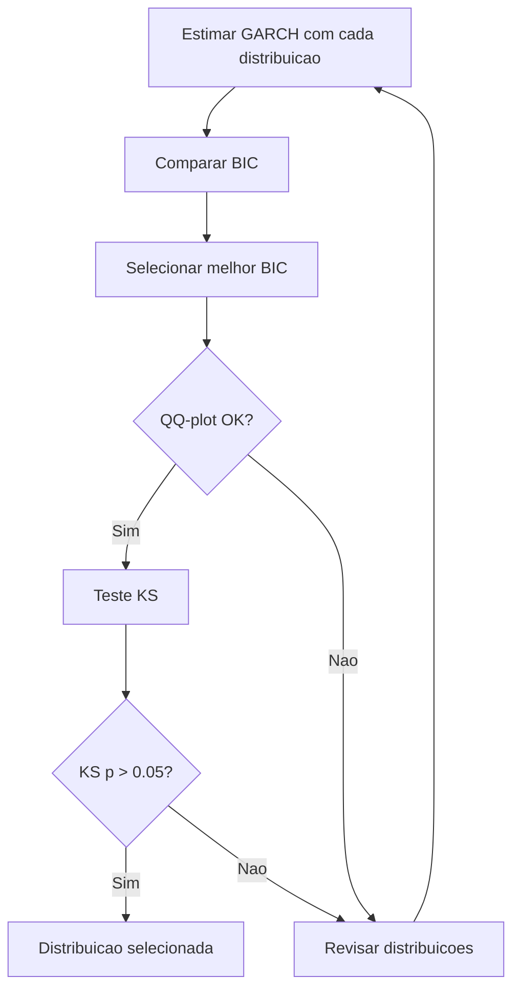

# Guia de Selecao de Distribuicoes

!!! info "Quick Reference"
    **Objetivo:** Selecionar a distribuicao condicional que melhor descreve os residuos padronizados do modelo GARCH.
    **Ferramentas:** BIC, QQ-plot, teste de Kolmogorov-Smirnov, Likelihood Ratio Test.
    **Principio:** Parcimonia -- comece simples, adicione complexidade apenas se justificada.

## Por que Selecionar a Distribuicao?

A escolha da distribuicao condicional afeta:

1. **Qualidade do ajuste**: uma distribuicao inadequada distorce a log-verossimilhanca
2. **Inferencia**: erros-padrao e testes de hipotese dependem da distribuicao assumida
3. **Previsao de risco**: VaR e Expected Shortfall dependem diretamente dos quantis
4. **Simulacao**: cenarios gerados herdam as propriedades da distribuicao escolhida

!!! warning "Erro comum"
    Usar a distribuicao Normal por default, sem verificar se e adequada, e o erro mais comum em modelagem GARCH. A maioria dos retornos financeiros diarios tem caudas pesadas e frequentemente assimetria.

## Workflow de Selecao



### Etapa 1: Estimar com Todas as Distribuicoes

```python
from archbox import GARCH
from archbox.distributions import Normal, StudentT, SkewedT, GeneralizedError
from archbox.datasets import load_dataset

sp500 = load_dataset('sp500')

distributions = {
    'Normal': Normal(),
    'Student-t': StudentT(),
    'Skewed-t': SkewedT(),
    'GED': GeneralizedError(),
}

results = {}
for name, dist in distributions.items():
    model = GARCH(sp500['returns'], p=1, q=1, dist=dist)
    results[name] = model.fit()
    print(f"{name:12s} - LogLik: {results[name].loglike:10.2f}, "
          f"BIC: {results[name].bic:10.2f}, "
          f"AIC: {results[name].aic:10.2f}")
```

??? example "Output esperado"
    ```
    Normal       - LogLik:    3125.46, BIC:   -6228.13, AIC:   -6244.91
    Student-t    - LogLik:    3189.23, BIC:   -6348.07, AIC:   -6370.47
    Skewed-t     - LogLik:    3198.57, BIC:   -6359.13, AIC:   -6387.14
    GED          - LogLik:    3185.68, BIC:   -6340.96, AIC:   -6363.36
    ```

### Etapa 2: Comparar via BIC

O **Criterio de Informacao Bayesiano** (BIC) penaliza a complexidade do modelo, favorecendo parcimonia:

$$\text{BIC} = -2\ell + k \ln(T)$$

onde $\ell$ e a log-verossimilhanca, $k$ o numero de parametros e $T$ o numero de observacoes.

```python
import numpy as np

# Ranking por BIC (menor = melhor, mas BIC negativo -> mais negativo = melhor)
ranking = sorted(results.items(), key=lambda x: x[1].bic)

print("Ranking por BIC:")
print("-" * 50)
for i, (name, res) in enumerate(ranking, 1):
    print(f"  {i}. {name:12s}  BIC = {res.bic:.2f}")

best_name = ranking[0][0]
print(f"\nMelhor distribuicao: {best_name}")
```

!!! tip "Interpretacao do BIC"
    - Diferenca de BIC $< 2$: evidencia fraca -- modelos equivalentes
    - Diferenca de BIC entre 2 e 6: evidencia positiva a favor do melhor
    - Diferenca de BIC entre 6 e 10: evidencia forte
    - Diferenca de BIC $> 10$: evidencia muito forte

### Etapa 3: QQ-Plot Comparativo

```python
import matplotlib.pyplot as plt
from scipy import stats

fig, axes = plt.subplots(2, 2, figsize=(12, 10))
axes = axes.flatten()

for ax, (name, res) in zip(axes, results.items()):
    stats.probplot(res.resid, dist="norm", plot=ax)
    ax.set_title(f"QQ-Plot: {name}")
    ax.grid(True, alpha=0.3)

plt.tight_layout()
plt.show()
```

!!! note "Leitura do QQ-plot"
    - **Pontos sobre a diagonal**: distribuicao adequada
    - **Caudas acima da diagonal**: caudas mais pesadas que a Normal (precisa Student-t ou GED)
    - **Assimetria no QQ-plot**: precisa Skewed-t

### Etapa 4: Teste de Kolmogorov-Smirnov

O teste KS verifica se os residuos padronizados seguem a distribuicao assumida:

```python
from scipy import stats

best_res = results[best_name]
z = best_res.resid

# Testar contra Normal padrao
ks_stat, ks_pval = stats.kstest(z, 'norm')
print(f"Kolmogorov-Smirnov (vs Normal):")
print(f"  Estatistica: {ks_stat:.4f}")
print(f"  p-valor: {ks_pval:.4f}")
```

### Etapa 5: Likelihood Ratio Test (modelos aninhados)

Para distribuicoes aninhadas, pode-se testar formalmente:

```python
from scipy import stats

# H0: Normal vs H1: Student-t (1 parametro a mais)
lr_stat = 2 * (results['Student-t'].loglike - results['Normal'].loglike)
lr_pval = 1 - stats.chi2.cdf(lr_stat, df=1)
print(f"Normal vs Student-t:  LR = {lr_stat:.2f}, p = {lr_pval:.4f}")

# H0: Student-t vs H1: Skewed-t (1 parametro a mais)
lr_stat = 2 * (results['Skewed-t'].loglike - results['Student-t'].loglike)
lr_pval = 1 - stats.chi2.cdf(lr_stat, df=1)
print(f"Student-t vs Skewed-t: LR = {lr_stat:.2f}, p = {lr_pval:.4f}")
```

!!! note "Testes aninhados"
    O Likelihood Ratio Test so e valido para modelos aninhados:

    - Normal $\subset$ Student-t ($\nu \to \infty$)
    - Student-t $\subset$ Skewed-t ($\lambda = 0$)
    - Normal $\subset$ GED ($\nu = 2$)

    Para comparar modelos nao-aninhados (Student-t vs. GED), use BIC ou AIC.

## Workflow Completo

```python
from archbox import GARCH
from archbox.distributions import Normal, StudentT, SkewedT, GeneralizedError
from archbox.datasets import load_dataset
from scipy import stats
import numpy as np

# ===== 1. Carregar dados =====
sp500 = load_dataset('sp500')
returns = sp500['returns']

# ===== 2. Estimar com todas as distribuicoes =====
dists = {
    'Normal': Normal(),
    'Student-t': StudentT(),
    'Skewed-t': SkewedT(),
    'GED': GeneralizedError(),
}

results = {}
print("=" * 65)
print(f"{'Distribuicao':12s} {'LogLik':>10s} {'AIC':>10s} {'BIC':>10s} {'Params':>6s}")
print("=" * 65)

for name, dist in dists.items():
    model = GARCH(returns, p=1, q=1, dist=dist)
    res = model.fit(disp=False)
    results[name] = res
    n_params = len(res.params)
    print(f"{name:12s} {res.loglike:10.2f} {res.aic:10.2f} {res.bic:10.2f} {n_params:6d}")

# ===== 3. Ranking por BIC =====
print("\n--- Ranking por BIC ---")
ranking = sorted(results.items(), key=lambda x: x[1].bic)
for i, (name, res) in enumerate(ranking, 1):
    marker = " <-- melhor" if i == 1 else ""
    print(f"  {i}. {name:12s}  BIC = {res.bic:.2f}{marker}")

best_name, best_res = ranking[0]

# ===== 4. Diagnosticos dos residuos =====
z = best_res.resid

print(f"\n--- Diagnosticos: {best_name} ---")
print(f"  Curtose:    {stats.kurtosis(z, fisher=False):.4f}")
print(f"  Assimetria: {stats.skew(z):.4f}")

jb_stat, jb_pval = stats.jarque_bera(z)
print(f"  Jarque-Bera: stat={jb_stat:.2f}, p={jb_pval:.4f}")

ks_stat, ks_pval = stats.kstest(z, 'norm')
print(f"  KS (vs Normal): stat={ks_stat:.4f}, p={ks_pval:.4f}")

# ===== 5. Likelihood Ratio Tests =====
print("\n--- Likelihood Ratio Tests ---")
lr = 2 * (results['Student-t'].loglike - results['Normal'].loglike)
p = 1 - stats.chi2.cdf(lr, df=1)
print(f"  Normal vs Student-t:   LR={lr:.2f}, p={p:.4f}")

lr = 2 * (results['Skewed-t'].loglike - results['Student-t'].loglike)
p = 1 - stats.chi2.cdf(lr, df=1)
print(f"  Student-t vs Skewed-t: LR={lr:.2f}, p={p:.4f}")

print(f"\n>>> Distribuicao recomendada: {best_name}")
```

## Guia Rapido de Decisao

| Situacao | Distribuicao recomendada |
|:---------|:------------------------|
| Residuos ~Normal no QQ-plot | [Normal](normal.md) |
| Caudas pesadas simetricas | [Student-t](student-t.md) |
| Caudas pesadas + assimetria | [Skewed Student-t](skewed-t.md) |
| Caudas entre Laplace e Normal | [GED](ged.md) |
| Dados de equities (default robusto) | [Skewed Student-t](skewed-t.md) |
| Dados de cambio (FX) | [Student-t](student-t.md) ou [GED](ged.md) |
| Pouca experiencia | Comece com [Student-t](student-t.md) |

!!! tip "Recomendacao geral"
    Para a maioria das aplicacoes financeiras, a **Student-t** e um bom default. Se o Sign Bias Test indica assimetria significativa, mude para a **Skewed Student-t**. Use o BIC para confirmar a escolha.

## Armadilhas Comuns

!!! danger "Erros frequentes"
    1. **Usar Normal sem testar**: a maioria dos dados financeiros requer caudas pesadas
    2. **Ignorar o BIC**: log-verossimilhanca sempre aumenta com mais parametros -- use BIC
    3. **Sobre-parametrizar**: Skewed-t com amostra pequena pode ser instavel
    4. **Esquecer de verificar convergencia**: distribuicoes mais complexas podem nao convergir
    5. **Confundir modelo e distribuicao**: mesmo a melhor distribuicao nao salva um GARCH mal especificado

## References

- Bao, Y., Lee, T.-H., & Saltoglu, B. (2007). Comparing Density Forecast Models. *Journal of Forecasting*, 26(3), 203--225.
- Hansen, B. E. (1994). Autoregressive Conditional Density Estimation. *International Economic Review*, 35(3), 705--730.
- Theodossiou, P. (1998). Financial Data and the Skewed Generalized T Distribution. *Management Science*, 44(12), 1650--1661.

## See Also

- [Normal](normal.md) -- Distribuicao baseline
- [Student-t](student-t.md) -- Caudas pesadas simetricas
- [Skewed Student-t](skewed-t.md) -- Caudas pesadas com assimetria
- [GED](ged.md) -- Flexibilidade no formato das caudas
- [GARCH(p,q)](../garch/garch.md) -- Modelo base de volatilidade
