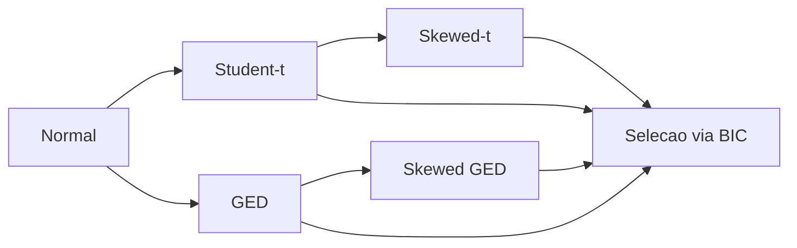

# Distribuicoes Condicionais

## Por que a escolha de distribuicao importa?

Em modelos GARCH, a equacao da media e escrita como:

$$r_t = \mu + \epsilon_t, \qquad \epsilon_t = \sigma_t z_t, \qquad z_t \sim D(0, 1)$$

onde $z_t$ sao as **inovacoes padronizadas** e $D(0,1)$ e a distribuicao condicional escolhida. A escolha de $D$ afeta diretamente:

- **Estimacao**: a log-verossimilhanca depende da PDF de $D$
- **Inferencia**: erros-padrao e testes de hipotese assumem $D$
- **Previsao de risco**: VaR e Expected Shortfall dependem dos quantis de $D$
- **Simulacao**: cenarios gerados refletem as caudas e assimetria de $D$

!!! warning "A Normal nao e suficiente"
    Retornos financeiros apresentam **caudas pesadas** (excesso de curtose) e frequentemente **assimetria negativa** (crashes sao mais extremos que rallies). Usar a distribuicao Normal subestima o risco de eventos extremos, levando a VaR e ES excessivamente otimistas.

## Tabela Comparativa

| Distribuicao | Classe | Parametros extras | Caudas pesadas | Assimetria | Referencia |
|:-------------|:-------|:-----------------|:--------------:|:----------:|:-----------|
| [Normal](normal.md) | `Normal` | Nenhum | :material-close: | :material-close: | -- |
| [Student-t](student-t.md) | `StudentT` | $\nu$ (graus de liberdade) | :material-check: | :material-close: | Bollerslev (1987) |
| [Skewed Student-t](skewed-t.md) | `SkewedT` | $\nu$, $\lambda$ (assimetria) | :material-check: | :material-check: | Hansen (1994) |
| [GED](ged.md) | `GeneralizedError` | $\nu$ (forma) | :material-check: | :material-close: | Nelson (1991) |
| [Skewed GED](skewed-ged.md) | -- | $\nu$ (forma), $\lambda$ (assimetria) | :material-check: | :material-check: | Theodossiou (1998) |

!!! info "Imports"
    ```python
    from archbox.distributions import Normal, StudentT, SkewedT, GeneralizedError
    ```

## Impacto Visual: QQ-Plots

A maneira mais direta de avaliar se a distribuicao escolhida e adequada e atraves do **QQ-Plot** dos residuos padronizados. Se a distribuicao for correta, os pontos devem cair sobre a linha diagonal.

```python
from archbox import GARCH
from archbox.distributions import Normal, StudentT
from archbox.datasets import load_dataset
import matplotlib.pyplot as plt
from scipy import stats
import numpy as np

sp500 = load_dataset('sp500')

# Estimar com Normal e Student-t
model_n = GARCH(sp500['returns'], p=1, q=1, dist=Normal())
res_n = model_n.fit()

model_t = GARCH(sp500['returns'], p=1, q=1, dist=StudentT())
res_t = model_t.fit()

# Comparar QQ-plots
fig, axes = plt.subplots(1, 2, figsize=(12, 5))

stats.probplot(res_n.resid, dist="norm", plot=axes[0])
axes[0].set_title("QQ-Plot: Normal")

stats.probplot(res_t.resid, dist="norm", plot=axes[1])
axes[1].set_title("QQ-Plot: Student-t")

plt.tight_layout()
plt.show()
```

No QQ-plot tipico de retornos financeiros:

- **Normal**: caudas desviam fortemente da diagonal (formato "S")
- **Student-t**: melhor ajuste nas caudas, mas assume simetria
- **Skewed-t**: melhor ajuste global, captura assimetria

## Hierarquia de Complexidade



A escolha segue o **principio da parcimonia**: comece com a Normal, adicione complexidade apenas se justificada pelos dados. O [Guia de Selecao](choosing.md) detalha como comparar distribuicoes sistematicamente.

## Propriedades Estatisticas

| Distribuicao | Curtose | Assimetria | Casos especiais |
|:-------------|:--------|:-----------|:----------------|
| Normal | 3 (fixa) | 0 (fixa) | -- |
| Student-t | $\frac{3(\nu-2)}{\nu-4}$ para $\nu > 4$ | 0 (fixa) | $\nu \to \infty$: Normal |
| Skewed-t | Depende de $\nu$ e $\lambda$ | Controlada por $\lambda$ | $\lambda = 0$: Student-t |
| GED | Depende de $\nu$ | 0 (fixa) | $\nu = 2$: Normal; $\nu = 1$: Laplace |
| Skewed GED | Depende de $\nu$ e $\lambda$ | Controlada por $\lambda$ | $\lambda = 0$: GED |

## Proximos Passos

<div class="grid cards" markdown>

-   :material-chart-bell-curve:{ .lg .middle } **Normal**

    ---

    Distribuicao baseline -- comece aqui

    [:octicons-arrow-right-24: Normal](normal.md)

-   :material-chart-bell-curve-cumulative:{ .lg .middle } **Student-t**

    ---

    Caudas pesadas simetricas

    [:octicons-arrow-right-24: Student-t](student-t.md)

-   :material-chart-scatter-plot:{ .lg .middle } **Skewed Student-t**

    ---

    Caudas pesadas + assimetria

    [:octicons-arrow-right-24: Skewed-t](skewed-t.md)

-   :material-chart-areaspline:{ .lg .middle } **GED**

    ---

    Flexibilidade na forma das caudas

    [:octicons-arrow-right-24: GED](ged.md)

-   :material-chart-timeline-variant:{ .lg .middle } **Skewed GED**

    ---

    GED com assimetria

    [:octicons-arrow-right-24: Skewed GED](skewed-ged.md)

-   :material-compass:{ .lg .middle } **Guia de Selecao**

    ---

    Como escolher a melhor distribuicao

    [:octicons-arrow-right-24: Guia de Selecao](choosing.md)

</div>
