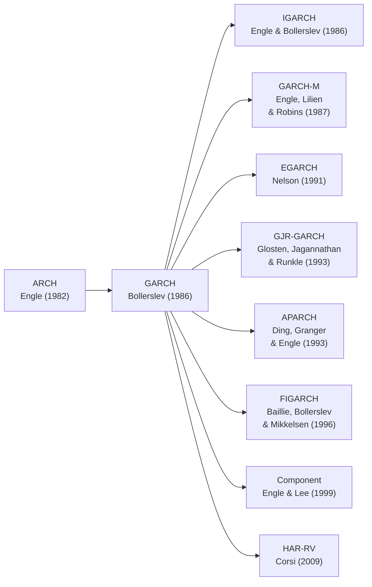

# GARCH Univariado

Modelos da familia GARCH (Generalized Autoregressive Conditional Heteroskedasticity) sao a ferramenta padrao para modelar **volatilidade condicional** em series temporais financeiras. A ideia central e que a variancia dos retornos nao e constante ao longo do tempo -- ela se agrupa em clusters de alta e baixa volatilidade -- e essa dinamica pode ser capturada por um modelo autorregressivo.

A familia comecou com o modelo ARCH de **Engle (1982)**, que modelava a variancia condicional como funcao de choques passados. **Bollerslev (1986)** generalizou o ARCH ao incluir lags da propria variancia condicional, criando o GARCH -- que se tornou o modelo mais utilizado em financas empiricas. Desde entao, diversas extensoes foram propostas para capturar assimetria (leverage), memoria longa, e risco no retorno medio.

## Modelos Disponiveis

| Modelo | Classe | Caracteristica Principal | Referencia |
|--------|--------|-------------------------|------------|
| [GARCH(p,q)](garch.md) | `GARCH` | Modelo padrao simetrico | Bollerslev (1986) |
| [EGARCH](egarch.md) | `EGARCH` | Assimetria logaritmica, sem restricao de positividade | Nelson (1991) |
| [GJR-GARCH](gjr-garch.md) | `GJR_GARCH` | Efeito leverage via indicadora | Glosten, Jagannathan & Runkle (1993) |
| [APARCH](aparch.md) | `APARCH` | Potencia assimetrica flexivel | Ding, Granger & Engle (1993) |
| [FIGARCH](figarch.md) | `FIGARCH` | Memoria longa na variancia | Baillie, Bollerslev & Mikkelsen (1996) |
| [IGARCH](igarch.md) | `IGARCH` | Persistencia unitaria (raiz unitaria na variancia) | Engle & Bollerslev (1986) |
| [GARCH-M](garch-m.md) | `GARCH_M` | Risco na equacao da media | Engle, Lilien & Robins (1987) |
| [Component GARCH](component.md) | `ComponentGARCH` | Decomposicao em componentes de curto e longo prazo | Engle & Lee (1999) |
| [HAR-RV](har-rv.md) | `HAR_RV` | Volatilidade realizada heterogenea | Corsi (2009) |

## Evolucao Historica



## Escolhendo um Modelo

| Caracteristica dos Dados | Modelo Recomendado | Justificativa |
|--------------------------|-------------------|---------------|
| Clusters de volatilidade simples | [GARCH(1,1)](garch.md) | Modelo padrao, robusto e parcimonioso |
| Choques negativos aumentam mais a volatilidade | [EGARCH](egarch.md) ou [GJR-GARCH](gjr-garch.md) | Capturam efeito leverage |
| Leverage com potencia flexivel | [APARCH](aparch.md) | Aninha GARCH e GJR como casos especiais |
| Autocorrelacao lenta na variancia | [FIGARCH](figarch.md) | Memoria longa fracionaria |
| Persistencia proxima de 1 | [IGARCH](igarch.md) | Impoe raiz unitaria na variancia |
| Volatilidade afeta retorno esperado | [GARCH-M](garch-m.md) | Premio de risco variavel no tempo |
| Tendencia de longo prazo + ciclos | [Component GARCH](component.md) | Separa componentes transitorios e permanentes |
| Dados intradiarios disponiveis | [HAR-RV](har-rv.md) | Usa volatilidade realizada em multiplas frequencias |

!!! tip "Ponto de partida"
    Na duvida, comece com o [GARCH(1,1)](garch.md). Ele captura os fatos estilizados mais importantes (clustering, caudas pesadas) e serve como benchmark para comparar modelos mais complexos. Avance para EGARCH ou GJR-GARCH se o teste de Sign Bias indicar efeito leverage significativo.

## Univariado vs. Multivariado

| Aspecto | Univariado (esta secao) | [Multivariado](../multivariate/index.md) |
|---------|------------------------|------------------------------------------|
| Numero de series | 1 ativo | 2+ ativos |
| Output principal | $\sigma_t^2$ (variancia condicional) | $H_t$ (matriz de covariancia condicional) |
| Uso tipico | Previsao de vol, VaR de ativo unico | Otimizacao de portfolio, hedging, correlacao dinamica |
| Complexidade | Baixa | Alta (cresce com $N^2$) |

## Quick Example

```python
from archbox import GARCH
from archbox.datasets import load_dataset

sp500 = load_dataset('sp500')

# GARCH(1,1) padrao
model = GARCH(sp500['returns'], p=1, q=1)
results = model.fit()
print(results.summary())

# Persistencia e meia-vida
print(f"Persistencia: {results.persistence():.4f}")
print(f"Meia-vida: {results.half_life():.1f} periodos")
```

## See Also

- [Distribuicoes Condicionais](../distributions/index.md) -- Escolha da distribuicao para os erros
- [Diagnosticos](../../diagnostics/index.md) -- Testes de especificacao apos estimacao
- [Gestao de Risco](../risk/index.md) -- VaR e ES baseados em modelos GARCH
- [Theory: GARCH](../../theory/garch-theory.md) -- Fundamentos teoricos detalhados

## References

- Engle, R. F. (1982). Autoregressive Conditional Heteroscedasticity with Estimates of the Variance of United Kingdom Inflation. *Econometrica*, 50(4), 987--1007.
- Bollerslev, T. (1986). Generalized Autoregressive Conditional Heteroskedasticity. *Journal of Econometrics*, 31(3), 307--327.
- Francq, C., & Zakoian, J.-M. (2019). *GARCH Models: Structure, Statistical Inference and Financial Applications* (2nd ed.). Wiley.
