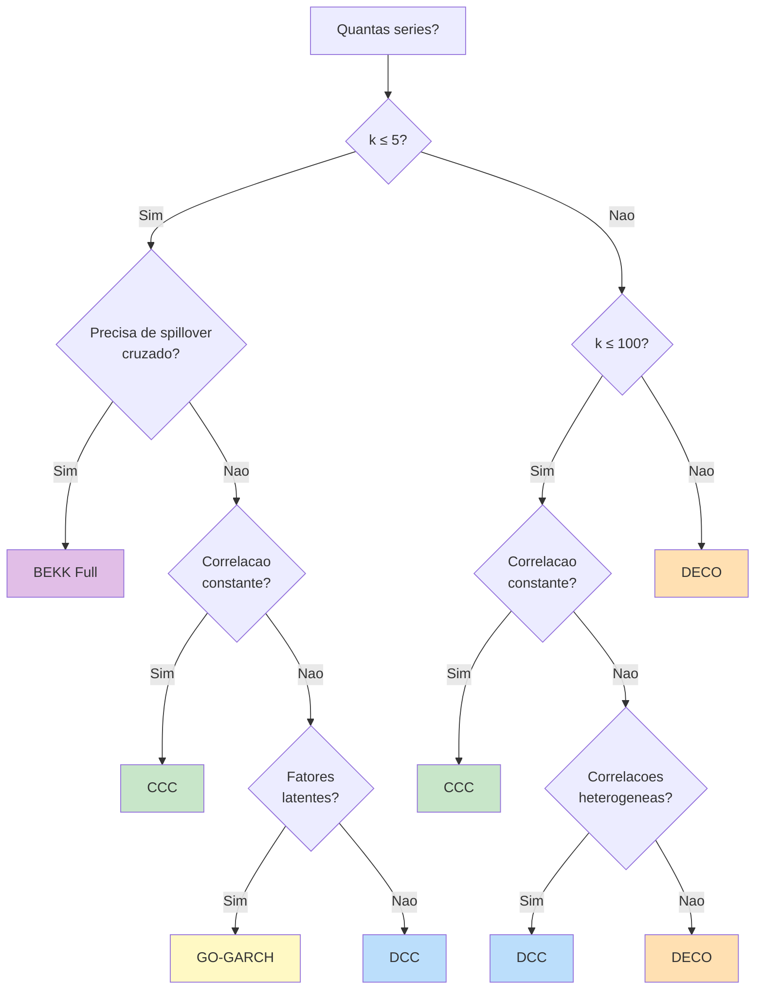
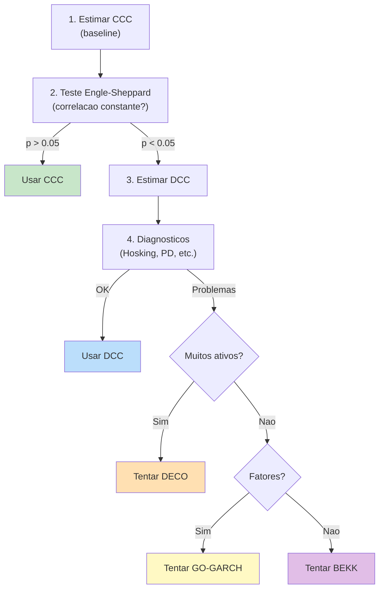

# Guia de Selecao Multivariado

Escolher o modelo GARCH multivariado correto depende de tres fatores principais: **numero de ativos**, **estrutura de correlacao** e **objetivo da analise**. Este guia fornece uma arvore de decisao pratica e comparacoes detalhadas.

## Arvore de Decisao



### Regras Praticas

1. **Poucos ativos ($k \leq 5$)**: Comece com [BEKK Diagonal](bekk.md). Se precisar de spillover cruzado, use BEKK Full.
2. **Muitos ativos ($k > 5$)**: Comece com [DCC](dcc.md). Teste correlacao constante para verificar se [CCC](ccc.md) e suficiente.
3. **Centenas de ativos ($k > 100$)**: Use [DECO](deco.md) para escalabilidade.
4. **Fatores de risco**: Use [GO-GARCH](go-garch.md) para decomposicao fatorial.

## Tabela Comparativa

| Criterio | CCC | DCC | BEKK | GO-GARCH | DECO |
|----------|:---:|:---:|:----:|:--------:|:----:|
| **Correlacao dinamica** | Nao | Sim | Sim | Sim | Sim (escalar) |
| **PD por construcao** | Sim* | Sim | Sim | Sim | Sim |
| **Spillover cruzado** | Nao | Nao | Sim (Full) | Nao | Nao |
| **Estimacao** | Dois passos | Dois passos | MLE completo | ICA + GARCH | Dois passos |
| **Params de correlacao** | 0 | 2 | $2k^2$ (Full) | 0 | 2 |
| **Complexidade** | Baixa | Media | Alta | Media | Baixa |

\* CCC e PD se a correlacao amostral $R$ e PD.

## Dimensao Maxima Pratica

| Modelo | $k_{\max}$ Recomendado | Justificativa |
|--------|:---:|---------------|
| BEKK Full | 3--5 | Explosao de parametros: $k(k+1)/2 + 2k^2$ |
| BEKK Diagonal | 5--10 | Reduzido, mas MLE completo ainda e caro |
| GO-GARCH | 10--20 | ICA requer amostra grande para muitos fatores |
| DCC | 50--100 | $O(k^2)$ por iteracao na recursao de $Q_t$ |
| CCC | 100+ | Sem otimizacao de correlacao |
| DECO | 500+ | Correlacao escalar, $O(k)$ efetivo |

## Criterios de Decisao Detalhados

### 1. A Correlacao e Constante?

Teste com **Engle & Sheppard (2001)**:

```python
from archbox.multivariate import CCC
from archbox.diagnostics import engle_sheppard_test

# Estimar CCC
ccc_results = CCC(endog).fit()
z = ccc_results.std_resids

# Testar H0: correlacao constante
es = engle_sheppard_test(z, lags=5)
print(f"Engle-Sheppard: p = {es.pvalue:.4f}")

if es.pvalue > 0.05:
    print("Correlacao constante adequada -> CCC")
else:
    print("Correlacao dinamica necessaria -> DCC, DECO ou GO-GARCH")
```

### 2. Quantos Ativos?

```python
k = endog.shape[1]

if k <= 5:
    print(f"k={k}: BEKK Diagonal e viavel")
    print("  Full BEKK tambem, se k <= 3")
elif k <= 50:
    print(f"k={k}: DCC recomendado")
    print("  GO-GARCH se suspeita fatores latentes")
elif k <= 100:
    print(f"k={k}: DCC possivel, DECO mais eficiente")
else:
    print(f"k={k}: DECO fortemente recomendado")
```

### 3. Ha Estrutura Fatorial?

Se voce suspeita que fatores de risco latentes explicam a co-dependencia:

```python
import numpy as np

# PCA para avaliar estrutura fatorial
cov_mat = np.cov(endog.T)
eigenvalues = np.linalg.eigvalsh(cov_mat)[::-1]
explained = eigenvalues / eigenvalues.sum()
cumulative = np.cumsum(explained)

print("Variancia explicada por componente:")
for i, (exp, cum) in enumerate(zip(explained, cumulative)):
    print(f"  PC{i+1}: {exp:.4f} ({cum:.4f} acumulada)")
    if cum > 0.95:
        print(f"  -> {i+1} fatores explicam 95% da variancia")
        break
```

!!! tip "Regra Pratica"
    Se poucos fatores ($< k/2$) explicam mais de 90% da variancia, GO-GARCH com reducao de dimensionalidade pode ser mais eficiente que DCC.

### 4. Precisa de Spillover?

**Spillover** refere-se a transmissao cruzada de volatilidade: um choque em um ativo afeta a volatilidade de outro.

- **Sim**: Apenas **BEKK Full** captura spillover diretamente (matrizes $A$ e $B$ cheias)
- **Nao**: DCC, CCC, DECO, GO-GARCH sao suficientes

## Exemplo Comparativo com Todos os Modelos

```python
import numpy as np
from archbox.multivariate import DCC, CCC, BEKK, GOGARCH, DECO
from archbox.diagnostics import engle_sheppard_test
from archbox.datasets import load_dataset

# Carregar dados
returns = load_dataset('equity_portfolio')
endog = returns[['PETR4', 'VALE3', 'ITUB4']].values
T, k = endog.shape
print(f"Series: {k}, Observacoes: {T}")

# Estimar todos os modelos
results = {}

# CCC
results['CCC'] = CCC(endog).fit()

# DCC
results['DCC'] = DCC(endog).fit()

# BEKK Diagonal
results['BEKK'] = BEKK(endog, variant="diagonal").fit()

# GO-GARCH
results['GO-GARCH'] = GOGARCH(endog).fit()

# DECO
results['DECO'] = DECO(endog).fit()

# Comparar
print("\n" + "=" * 65)
print(f"{'Modelo':<12} {'LogLik':>10} {'AIC':>12} {'BIC':>12} {'Params':>8}")
print("=" * 65)
for name, res in results.items():
    n_params = len(res.params) if hasattr(res, 'params') else 0
    print(f"{name:<12} {res.loglike:>10.2f} {res.aic:>12.2f} "
          f"{res.bic:>12.2f} {n_params:>8}")
print("=" * 65)

# Melhor por BIC
best = min(results, key=lambda x: results[x].bic)
print(f"\nModelo preferido (BIC): {best}")

# Teste de correlacao constante
z = results['CCC'].std_resids
es = engle_sheppard_test(z, lags=5)
print(f"Engle-Sheppard (CCC vs DCC): p = {es.pvalue:.4f}")
```

## Fluxo de Trabalho Recomendado



### Passo a Passo

1. **Comece com CCC**: baseline rapido e estavel
2. **Teste correlacao constante**: Engle-Sheppard decide se voce precisa de DCC
3. **Se dinamica, estime DCC**: modelo padrao para correlacao dinamica
4. **Rode diagnosticos**: Hosking, Li-McLeod, PD, Ljung-Box por serie
5. **Se problemas**: troque para BEKK (poucos ativos), GO-GARCH (fatores), ou DECO (muitos ativos)
6. **Compare por BIC**: parcimonia vs. ajuste

## Cenarios Tipicos

| Cenario | Modelo Recomendado | Justificativa |
|---------|-------------------|---------------|
| Hedge entre 2 ativos | BEKK Full | Spillover + PD + poucos params |
| Portfolio de 10 acoes | DCC | Escalavel, correlacao dinamica |
| Indice com 500 componentes | DECO | Unica opcao viavel |
| Fatores macro + retornos | GO-GARCH | Estrutura fatorial natural |
| Analise rapida, correlacao estavel | CCC | Simples, benchmark |
| Estudo de contagio entre 3 paises | BEKK Full | Spillover cruzado |
| Portfolio diversificado global | DCC ou DECO | Depende de $k$ |

## References

- Bauwens, L., Laurent, S., & Rombouts, J. V. K. (2006). Multivariate GARCH models: A survey. *Journal of Applied Econometrics*, 21(1), 79--109.
- Silvennoinen, A., & Teräsvirta, T. (2009). Multivariate GARCH models. In T. G. Andersen et al. (Eds.), *Handbook of Financial Time Series* (pp. 201--229). Springer.
- Caporin, M., & McAleer, M. (2012). Do We Really Need Both BEKK and DCC? A Tale of Two Multivariate GARCH Models. *Journal of Economic Surveys*, 26(4), 736--751.
- Engle, R. F., & Sheppard, K. (2001). Theoretical and Empirical Properties of Dynamic Conditional Correlation Multivariate GARCH. *NBER Working Paper* No. 8554.

## See Also

- [Index Multivariado](index.md) — Visao geral de todos os modelos
- [DCC](dcc.md) — Modelo mais popular
- [BEKK](bekk.md) — Maximo de flexibilidade
- [CCC](ccc.md) — Benchmark com correlacao constante
- [GO-GARCH](go-garch.md) — Reducao fatorial
- [DECO](deco.md) — Escalabilidade maxima
- [Diagnosticos Multivariados](diagnostics.md) — Testes para validar a escolha
