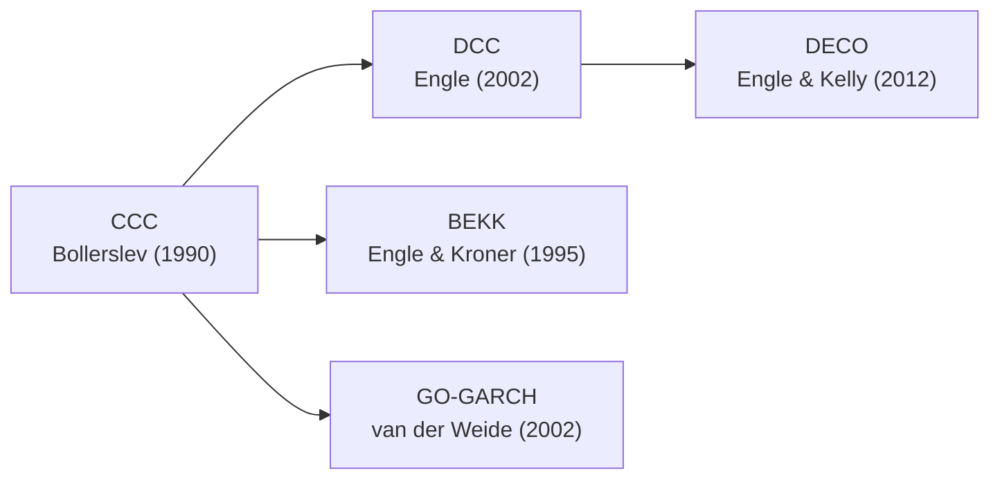

# GARCH Multivariado

Modelos GARCH multivariados estendem a modelagem de volatilidade condicional para **multiplas series simultaneamente**, capturando nao apenas a dinamica individual de cada variancia, mas tambem a **estrutura de correlacao e covariancia** entre os ativos ao longo do tempo.

Em financas, a correlacao entre ativos nao e constante. Durante crises, correlacoes tendem a aumentar drasticamente — exatamente quando a diversificacao seria mais necessaria. Modelos multivariados capturam essa dinamica, sendo essenciais para:

- **Otimizacao de portfolio**: pesos otimos dependem da covariancia condicional $H_t$
- **Hedging dinamico**: razoes de hedge variam com a covariancia entre ativo e instrumento
- **Value-at-Risk de portfolio**: risco conjunto depende de correlacoes dinamicas
- **Risco sistemico**: contágio e spillover entre mercados

## Modelos Disponiveis

| Modelo | Classe | Caracteristica Principal | Escalabilidade | Referencia |
|--------|--------|-------------------------|----------------|------------|
| [DCC](dcc.md) | `DCC` | Correlacao dinamica, estimacao em dois passos | Alta ($k > 100$) | Engle (2002) |
| [BEKK](bekk.md) | `BEKK` | Positiva-definitividade por construcao | Baixa ($k \leq 5$) | Engle & Kroner (1995) |
| [CCC](ccc.md) | `CCC` | Correlacao constante, volatilidades dinamicas | Alta ($k > 100$) | Bollerslev (1990) |
| [GO-GARCH](go-garch.md) | `GOGARCH` | Fatores ortogonais latentes | Media ($k \leq 20$) | van der Weide (2002) |
| [DECO](deco.md) | `DECO` | Equicorrelacao dinamica escalar | Muito alta ($k > 500$) | Engle & Kelly (2012) |

## A Maldição da Dimensionalidade

O desafio central dos modelos multivariados e que a matriz de covariância $H_t$ de dimensao $k \times k$ contem $k(k+1)/2$ elementos unicos. Conforme o numero de ativos $k$ cresce, o numero de parametros explode:

| Ativos ($k$) | Elementos em $H_t$ | BEKK Full | DCC | DECO |
|:---:|:---:|:---:|:---:|:---:|
| 2 | 3 | 11 | 2 + univ | 2 + univ |
| 5 | 15 | 65 | 2 + univ | 2 + univ |
| 10 | 55 | 230 | 2 + univ | 2 + univ |
| 50 | 1.275 | 5.150 | 2 + univ | 2 + univ |
| 100 | 5.050 | 20.200 | 2 + univ | 2 + univ |

!!! warning "Trade-off: Flexibilidade vs. Dimensionalidade"
    - **BEKK Full**: maximo de flexibilidade, mas impraticavel para $k > 5$
    - **DCC/DECO**: escalaveis, mas impoem estrutura na correlacao
    - **GO-GARCH**: reduz dimensionalidade via fatores, mas assume ortogonalidade

    A escolha do modelo depende do numero de ativos e da estrutura de correlacao esperada.

## Abordagem Geral: Decomposicao $H_t = D_t R_t D_t$

A maioria dos modelos multivariados decompoe a matriz de covariancia condicional:

$$H_t = D_t R_t D_t$$

onde:

- $D_t = \text{diag}(\sigma_{1,t}, \ldots, \sigma_{k,t})$ — matriz diagonal de volatilidades condicionais
- $R_t$ — matriz de correlacao condicional

Essa decomposicao separa o problema em dois:

1. **Passo 1**: Estimar as volatilidades individuais $\sigma_{i,t}$ via GARCH univariado
2. **Passo 2**: Estimar a dinamica da correlacao $R_t$

Excecoes: **BEKK** estima $H_t$ diretamente, e **GO-GARCH** usa fatores ortogonais.

## Evolucao Historica



## Quick Example

```python
import numpy as np
from archbox.multivariate import DCC
from archbox.datasets import load_dataset

# Carregar retornos de portfolio
returns = load_dataset('forex')  # Series de câmbio
endog = returns[['EURUSD', 'GBPUSD', 'USDJPY']].values

# Estimar DCC-GARCH
model = DCC(endog, univariate_model="GARCH", univariate_order=(1, 1))
results = model.fit()
print(results.summary())

# Correlacao dinamica entre EUR/USD e GBP/USD
results.plot_correlation(0, 1)

# Volatilidade do portfolio equal-weighted
weights = np.array([1/3, 1/3, 1/3])
port_vol = results.portfolio_volatility(weights)
```

## Escolhendo um Modelo

| Cenario | Modelo Recomendado | Justificativa |
|---------|-------------------|---------------|
| Portfolio com 2-5 ativos | [BEKK](bekk.md) | Flexibilidade maxima, positiva-definitividade garantida |
| Portfolio com 5-50 ativos | [DCC](dcc.md) | Correlacao dinamica escalavel |
| Correlacoes estaveis ao longo do tempo | [CCC](ccc.md) | Simples e eficiente |
| Muitos ativos ($> 50$) | [DECO](deco.md) | Equicorrelacao escalar, muito escalavel |
| Fatores latentes de risco | [GO-GARCH](go-garch.md) | Reduz dimensionalidade |

Consulte o [Guia de Selecao Multivariado](choosing-model.md) para uma arvore de decisao completa.

## Univariado vs. Multivariado

| Aspecto | [Univariado](../garch/index.md) | Multivariado (esta secao) |
|---------|--------------------------------|---------------------------|
| Numero de series | 1 ativo | 2+ ativos |
| Output principal | $\sigma_t^2$ (variancia condicional) | $H_t$ (matriz de covariancia $k \times k$) |
| Uso tipico | Previsao de vol, VaR de ativo unico | Portfolio, hedging, correlacao dinamica |
| Complexidade | Baixa | Alta (cresce com $k^2$) |
| Estimacao | MLE direto | Dois passos ou MLE conjunto |

## See Also

- [DCC](dcc.md) — Modelo mais popular, bom ponto de partida
- [Diagnosticos Multivariados](diagnostics.md) — Testes de especificacao para modelos multivariados
- [Guia de Selecao](choosing-model.md) — Arvore de decisao para escolher o modelo
- [GARCH Univariado](../garch/index.md) — Base para o passo univariado
- [Gestao de Risco](../risk/index.md) — VaR e ES de portfolio

## References

- Bauwens, L., Laurent, S., & Rombouts, J. V. K. (2006). Multivariate GARCH models: A survey. *Journal of Applied Econometrics*, 21(1), 79--109.
- Silvennoinen, A., & Teräsvirta, T. (2009). Multivariate GARCH models. In T. G. Andersen et al. (Eds.), *Handbook of Financial Time Series* (pp. 201--229). Springer.
- Engle, R. F. (2002). Dynamic Conditional Correlation: A Simple Class of Multivariate Generalized Autoregressive Conditional Heteroskedasticity Models. *Journal of Business & Economic Statistics*, 20(3), 339--350.
